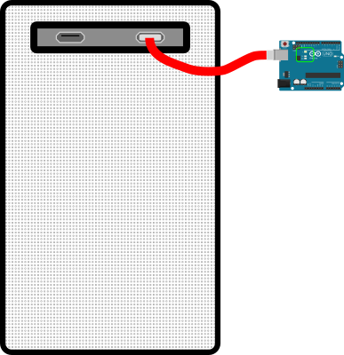
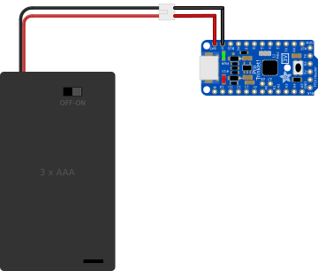

This project requires only one connection:

    Controller board ⇒ [ Some source of power ]

The "source of power" could be:

* a battery, or 
* a power supply, or 
* the USB port on your computer

In all other packets, *this connection won't be displayed*, but it will
be assumed.

## Power From a USB Port ##

| Desktop computer connected to Arduino UNO via USB cable |
|:-------------------------------------------------------:|
|             |

To connect an Arduino UNO to a computer, the USB cable must be of the form:

    "Standard A" (plugs into the computer) ⇒ "Standard B" (plugs into the Arduino UNO)

(In the diagram above, the green rounded rectangle near the middle of the controller
board is there to highlight the region of the onboard LED. 
The [demo](demo.html) shows this LED blinking ON and OFF.)

## Power From a Battery Pack ##

| Battery Pack connected to a Trinket Pro     |
|:-------------------------------------------:|
|  |

Connect the `+` side of the battery to the pin marked `BAT` on the Pro Trinket.

Connect the `-` side of the battery to the pin marked `GND` on the Pro Trinket.

The connector on the battery pack shown in the figure is called a "JST PH" connector; these
are commonly used in hobby products such as RC cars.  It is convenient to connect
to it using wires attached to a mating socket connector.

The *color* of your connecting cables is unimportant.  However, by convention, it is
customary to choose: 

* a black wire for the connection to `GND` on the controller board.  
* a red wire for the connection to `BAT` on the controller board.

