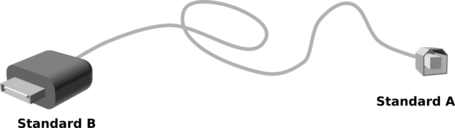
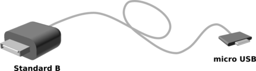
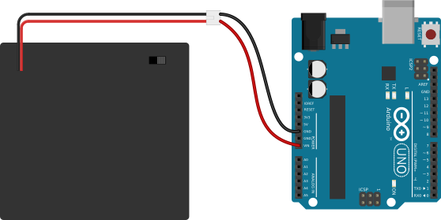

This project requires only one connection:  from the microcontroller board (UNO) to some source of
power.  That power could be supplied by a battery or through your USB cable.

In all other packets on this site, *this power connection won't be displayed*; 
it will be assumed.

## Connecting your computer to the UNO ##

You will need to connect your computer to the UNO in order to download 
your program to it.  This connection can also supply power, so once you have
programmed your Arduino, then if it remains connected to your computer, it
will commence running that program until you disconnect it or reset it.

There are many types of USB cables, featuring not only diffences in the
shape of their connectors, but also in the information they carry.
All USB cables that connect to your computer have one rectangular end
which is approximately 1/2" across; this is called a "Standard B" connector.
The other end may have any one of several types of USB connectors. Some
Arduino boards require a square-ish connector called "Standard A".  Others
require a small flat connector called "micro USB".  Images are shown
below:

| "Standard B" to "Standard A"   | "Standard B" to "MicroUSB"      |
|:------------------------------:|:-------------------------------:|
|    | |    

Whichever shape of USB cable you need, be sure to get one which is a 
"data" USB cable.  Whereas a USB "power" cable carries only a `+5V` signal
and a `GND` signal, a USB "data" cable **also** include data signals.
This is essential for programming your Arduino.

## Powering the microcontroller board with a battery ##

Once an Arduino board has been programmed, you can detach it from your
computer and power it from batteries.  (Otherwise Arduinos couldn't be 
used in robots.)  A group of 1 or more batteries can be used; in any
case, the total voltage of those batteries must lie between >7V but \<12V.

Be sure to connect the positive (`+`) voltage from the battery to the `VIN` pin
on the UNO.  Unlike the `5V` pins on the UNO, voltage the comes into the UNO
through the `VIN` pin goes throught the on-board voltage regulator; this protects
your board from damage.

**Note: It is a convention to use red cables for the positive voltage, and
black cables for 0V, or "ground".**

| Uno Connected to a pack of 4 1.5V batteries |
|:-------------------------------------------:|
|      |

