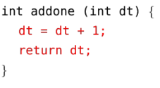
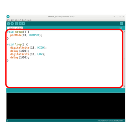
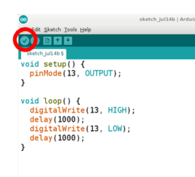
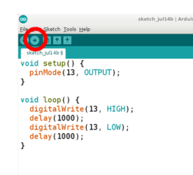

## General structure of an Arduino program ##

Programs written in the Arduino IDE are called "sketches".

* Every sketch must contain (at least) two functions, pre-named `setup()` and `loop()`.
* A function is a list of statements.

Your job is to write the statements that define what those functions do.

## Anatomy of a statement ##

There are many types of statements, but you can get started writing sketches 
using only expression-type statements.  

Here are some examples:

`x = 1000;`
: Tells the microcontroller to store the value on the right hand side into a
: memory location which will henceforth be named `x`.

`x = dt * 2;`
: Tells the microcontroller to retrieve the value in the memory location named
:`dt`, multiply it by `2`, and then store the result in the location named `x`.

Syntax note:  

* every statement *must* end in a semi-colon.

So how does a particular area of the microcontroller's memory get 
assigned a "name"?  Answer:  before a variable can be used, it must be 
"declared", i.e., you must tell `arduino` what type of variable it is, so
that it will reserve enough memory to store that variable.

For example,

`int x;`
: Reserves 4 bytes of memory, and names that memory location `x`.

`char mychar;`
: Reserves 1 byte of memory, and names that memory location `mychar`.
 
Syntax note:  

* Variable declarations like those above *must* occur before those variables
are used in your program.

## Anatomy of a function ##

A function is a block of statements which can be executed as a single
command.  A function may have some inputs (arguments) and may have some 
outputs (return value).  

Here are some examples of *using* a function:

`x = sqrt(y);`  
: Fetches the value stored in the location named `y`, then
: invokes the function `sqrt()` with the value of `y` as a parameter, which returns a result, and
: stores the result in the location named `x`.   

`portlimit = 2 * myfunc(portno, times);`
: Fetches the value stored in `portno`, and 
: fetches the value stored in `times`, and
: invokes the function `myfunc()` with these parameters, which returns a result, then 
: multiplies that result by 2, and finally
: stores the product at the location named `portlimit`.

`initCounter();`
: Execute the statements inside `initCounter()`.
: (That's all; do not return any result.)

Here is an example of *writing* a function:

    int addOne(int dt) {
       dt = dt + 1;
       return dt;
    } 

As above, this function might be used like this: 

`newCount = addOne(522);`
: invoke the function `addOne() with the argument `522`, and return the result
: store the result in the location `newCount`.

The components of every function are:

|         Name | Input Parameter(s) w/ type  | Statement(s) | Return Type |
|:------------:|:---------------------------:|:------------:|:-----------:|
|  |  |  |  | 

Syntax notes:  

* The statements belonging to a function *must* be enclosed in curly braces.
* Functions with no input parameters can be written with the parameter list `()`, or `(void)`.
>   If there are two or more input parameters, they must be separated by a comma.
* If the function does not return a value, then its return type is `void`.

## Writing your own functions ##

To program an Arduino board, you must write the *statements* that define each of 
two functions:

` setup()`
: This function is executed only once, immediately after the board is powered on or reset.
: It is used, among other thngs, to initialize the state of the I/O pins.
:
: `setup()` has no input parameters.  (This is why the parentheses are empty.)
: `setup()` returns no output value.  (So its return "type" is `void`.)

`loop()`
: This function is executed repeatedly until the board is powered off or reset.
:
: `loop()` has no input parameters.  (This is why the parentheses are empty.)
: `loop()` returns no output value.  (So its return type is `void`.)

A bare-bones sketch to turn on the on-board LED for 1 second, and 
then turn it off for 1 second is shown below.

    void setup() {
        pinMode(13, OUTPUT);    // Call the function "pinMode" with two parameters
                                // pinMode will not return a value.
        digitalWrite(13, LOW);  // Call the function "digitalWrite" with one parameter
                                // digitalWrite will not return a value.
    }

    void loop() {
        digitalWrite(13, HIGH); 
        delay(1000);            
        digitalWrite(13, LOW); 
        delay(1000);            

    }

The statements in the `setup()` function tell the microcontroller to:

* use Digital I/O pin 13 in `OUTPUT` mode, and
* set the initial output value on that pin to a logical `LOW` level (0V).

The statements in the `loop()` function tell the microcontroller to::

* set pin 13 to a logical `HIGH` level (5V), then
* do nothing for 1000 milliseconds (1 msec), then
* set pin 13 to logical `LOW` level (0V), then
* waits 1 msec.  

Enter the above program into the big white programming window in the `arduino` GUI
(see the figure below at left).  Check that it can be understood by the compiler by 
clicking the check symbol in in the left of the toolbar (figure below, center).  
Then download the (compiled) program to your Arduino by clicking the right arrow 
next to the check symbol (figure below, right). 

| Text Window             |  Compile Button         | Download Button         |
|:-----------------------:|:-----------------------:|:-----------------------:|
|  |  |  | 

Syntax note:

* Double forward slashes (`//`) introduce a comment, which is ignored by `arduino`, but
will probably be useful to you or someone else who uses your code.  **Comments are good practice.**

## Under the hood ##

In reality, the sketch above is not, by itself, enough to program the Arduino.  

Instead, `arduino` takes your sketch, and wraps a larger, pre-written program 
around it.  That larger program calls your `setup()` function once, and then 
calls your `loop` function forever.  When you compile your sketch (by 
clicking the check button in the toolbar, you will be actually be 
compilng this larger program.

## An Improved Version ##

A simple improvement to the above program makes it much easier to maintain.  

Suppose you wanted to use the same code (or similar) on another microcontroller 
board where the on-board LED was controlled through digital pin 8.  Then you'd 
have to modify the above program in 3 places.

To avoid that, write a *single* statement at the top of the program, where
you specify the pin number of the on-board LED, and assign that value to a
"name"; in this case, the name "LED" is an obvious choice, but "ONBOARDLED"
would work fine also.  (It is common practice to use names with all caps for
values that won't be changed during the course of the program.)  

    int LED=13;                   // This is now the only statement that needs fixing if you
                                  // decide to change the pin number where the led is attached.

    void setup() {
        pinMode(LED, OUTPUT);     
        digitalWrite(LED, LOW);   
    }

    void loop() {
        digitalWrite(LED, HIGH);  
        delay(1000);              
        digitalWrite(LED, LOW);   
        delay(1000);              

    }

Syntax note:

* Any variable which is meant to be visible to all your functions must be declared
before all of them, i.e., at the start of your program.  Such a variable is said
to be "global".

