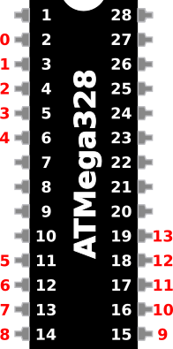
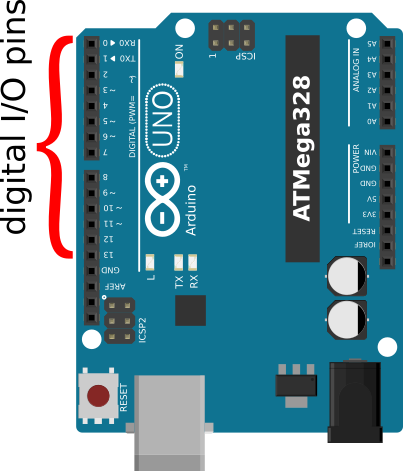

## Introduction to Digital I/O Pins ##

Every microcontroller has at least some pins designated for use as 
"digital I/O".  

* "I/O" means these pins can only be used for input (to read a signal from 
another source, e.g., a light meter) or output (to provide a voltage to
drive another device, e.g., a motor).  

* "Digital" means that these pins can only detect (as input) or produce 
(as output) voltages that are at one of two logic levels:  `HIGH` or `LOW`.  

> > Depending on the chip, logic `HIGH` = 5V, and logic `LOW` = 0V.  
> > Modern "3.3V" chips use `HIGH` = 3.3V.

> > The actual voltages that correspond to `HIGH` and `LOW` lie in a 
> > band *near* 0V and *near* 5V.

## Finding the Digital I/O Pins on Your Hardware ##

On the ATMega328 microcontroller which is at the heart of the Arduino UNO R3 board,
there are 14 pins used for digital I/O.  They are designated I/O pins 0 through 13.  

On the Arduino UNO R3 board, all 14 of the ATMega328's digital I/O pins are made
accessible through one of the "header" pins on one edge of the board.  The pin 
numbers on the UNO correspond exactly to the pin numbers on the ATMega328 chip.

| Digital I/O pins on the ATMega328  | Corresponding pins on the UNO R3 |
|:----------------------------------:|:--------------------------------:|
|  |   |

## First Project: Blink an On-Board LED ##

Most microcontroller boards comes equipped with at least two built-in LEDs.

* One LED simply tells whether the board is powered on.  

* The other LED is tied to one of the microcontroller's digital I/O pins, 
and can therefore be controlled by the program in the microcontroller's memory.

The sample program in this packet will cause that second LED to turn on for 
1 second, then turn off for 1 second; this will repeat indefinitely.

Once you follow the example in this packet, you will know how to:

* write a simple program (aka "sketch") to "blink" the LED

* check and compile the sketch 

* download your sketch to your microcontroller board

This packet's "todo" page suggests ways you can modify the sketch to 
shorten (or lengthen) the "on" time or "off" time, and to create a more 
complicated blink pattern.
