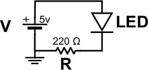
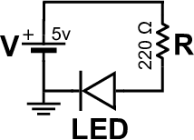
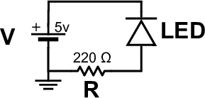
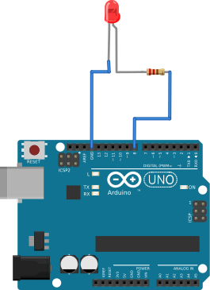
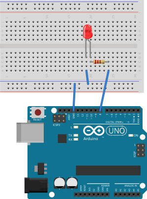

% Trinket Pro 3.3V
% Susan G. Kleinmann
% May 22, 2016

### Components of the Circuit ###

There are three essential components to this circuit:

the voltage source
:    For this exercise, the voltage source will be one of the pins on your Arduino board.
:    The sketch on the Arduino board will drive that pin `HIGH` to set the pin output  to 5V, 
:    or `LOW` to set it to 0V.

the LED
:    a standard 2-wire LED; this type of LED can only produce 1 color.  (In contrast,
:    4-wire LEDs can produce any RGB color.)

a resistor
:    The purpose of this resistor is to limit the current through the LED.  This prevents
:    the LED from burning out prematurely.  A resistor used for this purpose is called
:    a "current limiting resistor".

### Layout of the Circuit ###

The *order* of the components in the circuit is unimportant, but the *orientation* of
the LED with respect to the voltage source is critical.
The LED must be inserted into the circuit so that the voltage at its anode is higher
than the voltage at its cathode.  

| LED follows voltage source  | Resistor follows voltage source | LED is inserted backwards   |
|:---------------------------:|:-------------------------------:|:---------------------------:|
|    |        |        |
|  |      |  |

### Making the Connections ###

To assemble the circuit, you can either:

* solder the LED to the resistor (as shown in the image at left below), OR
* use a breadboard (as shown in the image at right)

| Without a Breadboard            | With a Breadboard              |
|:-------------------------------:|:------------------------------:|
|  |  | 

The advantage of the breadboard is that you can just plug components in and 
out, taking advantage of the internal wiring of the breadboard to make the 
actual electrical connections.  For more detail on the internal layout of 
breadboards, see this [explanation of breadboards](index.html).

Both of the drawings shown above assume that you will also connect some
source of power to your Arduino board, e.g., the USB plug of your computer
or an external battery, as shown in [this page](./1-blink-onboard/circuit.html).

### Which Arduino pin should you use? ###

The choice of pin 8 in the above drawing is somewhat arbitrary. Any of the pins 0--13 will 
work.  However:

* the pin named as the `OUTPUT` pin in your sketch must correspond to the pin name on the board; 
this includes pins A0..A5.  So if you use pin 8, then your `OUTPUT` pin is `8`.  But if you
use pin `A0`, then your `OUTPUT` pin is `A0`.
* it is good practice *not* to use pin 0 because that pin is also used to serial communications.
* it is good practice *not* to use pin 13 unless you want the onboard LED to blink whenever
you make the LED blink.

