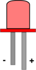
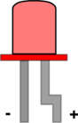
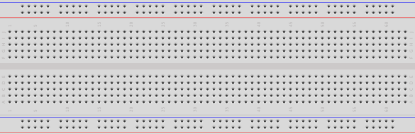
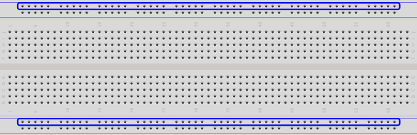
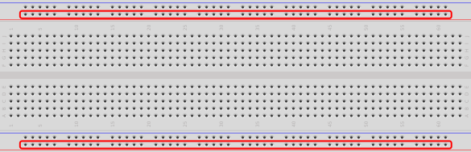
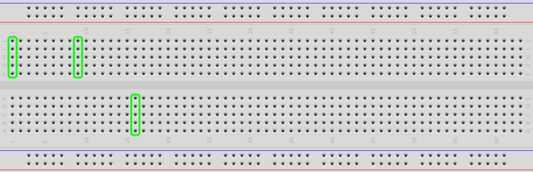
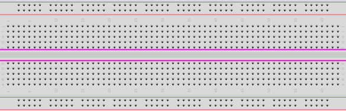
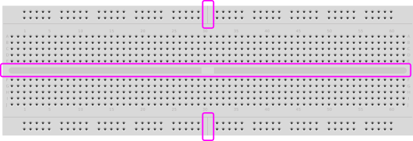

## Blink a Single External LED ##

This packet shows how to control a single external LED with an Arduino board. 

The code for this packet is similar to the code for blinking the on-board LED.  However, 
the circuit is different.

### Introduction to New Components ###

For this packet, you will attach two components to your Arduino:

1.  the LED itself.  Monochome LEDs have 2 leads, where one is longer than the other.
The longer lead is the "anode" or positive lead.  The shorter lead is the "cathode" or negative lead.
When you get a new LED, both leads are straight and it is easy to see which one is longer.  
Once an LED has been used, the longer lead is often bent so that the two leads have the same 
top-to-bottom height, which is convenient for connecting in breadboards.  The bent lead will is 
still the anode, it's just harder to recognize.

|           |         |
|:-------------------------------:|:---------------------------------:|
| (New: leads are still straight) | (Used: longer lead has been bent) |

2.  a resistor.  The resistor will have have 2 leads.  Resistors have no polarity, there is no
"anode" or "cathode".  The colored bands on the resistor can (in principle) tell you its value.
(However, it is difficult to remember the color code.)  A 220Ω resistor has a these bands:

    * a red band, indicating the resistance's most significant digit is  2.
    * a red band, indicating the resistance's next most significant digit is also 2. 
    * a brown band, indicating the exponent of the resistor's value is 2, so the resistor's value is
    2.20 × 10^2 = 2.20 × 100 = 220Ω.
    * (usually) a gold band, indicating that its value is accurate to ±5%.

### Connecting the components: solder or use a breadboard?  ###

The most direct way to connect the components is to:

* plug one lead of the LED into whichever I/O pin you'll use on the Arduino, 
* connect the other lead to one lead of the resistor, and
* connect the other lead of the resistor to one of the  `GROUND` pins on the Arduino.  

With this approach, you will need to solder the LED to the resistor.  This is
time-consuming, requires extra equipment, and makes it difficult for you to re-use the LED
(or the resistor) in another circuit.  

The solution is to use a "breadboard" which allows you to make temporary connections simply
by plugging components in to the "right" holes.
The real electrical connections are made inside the breadboard.  

|       | 
|:---------------------------------------:|
| A "full-sized" breadboard               |

To use the breadboard effectively, follow these rules:

1.  All of the holes along each edge of the board are connected together.  Traditionally,
users connect a jumper cable from a hole near the blue line and one of the `GROUND` connections
on the Arduino board, and then connect all components in the circuit that need a `GROUND` connection
to that horizontal line of holes.  When needed, users connect a jumper cable from a hole near the red
line to the `5V` (or `3V`) pin on the Arduino board, and then connect all components requiring that
power to other holes near the red line.

|  |  | 
|:----------------------------------:|:-----------------------------------|
| Two rows of "GND" connections      | Two rows of "Power" connections    |

2.  The 5 holes in each column (aka "field") are connected together, but no field is 
connected to any other field.  Several separate fields are shown below:

3.  NONE of the holes on one side of the great divide going down the middle of the breadboard
are connected to ANY of the holes on the opposite side.  The "great divide" is highlighted
below:

4.  Some breadboards have an additional divide in the middle of the board.  Such boards
are electrically divided into 4 separate parts.

