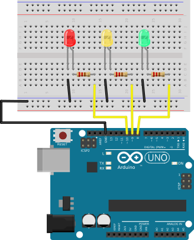

%
% Susan G. Kleinmann
% June 25, 2016

The circuit below includes:

* three LEDs, one each of red, yellow, and green
* three current limiting resistors, each about 220Ω
* an Arduino microcontroller board

The cathode (`-`) of each LED should be connected to the `GND` bus of the breadboard.

The anode (`+`) of each LED should be connected to one end of a resitor.

The other end of the resistor should be connected to one of the digital I/O pins on
the microcontroller board.  Any pin will do.  However:

* if you connect one of the LEDs to pin 13, then when you blink the LED, then the 
on-board LED will blink also.
* if you use I/O pins 0 or 1, you will not be able to download your sketch to
the board (since those pins are used for serial communication).

| Circuit with Several LEDs        |
|:--------------------------------:|
|    | 

