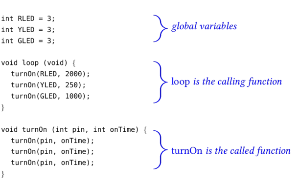

## Using Functions to Simplify Your Code ##

If you have written even one Arduino sketch, you have already written at least
two functions:  

> >   `setup()` and 

> >   `loop()`.  

### You Can Write Your Own Functions ###

You can add any number of additional functions to your arduino sketch.  
The structure and contents of functions must follow some guidelines
as shown in the figure below.  Things to note:

> > **name**
> > : the name of the function below is `loop`.  The name of a function can
> > : not contain spaces or punctuation marks (only letters, numbers, digits, and
> > : the underscore character (`_`) are allowed.  Function names must begin
> > : with a letter or underscore.  Case matters, so `loop` is not the same as
> > : `Loop`. 
> > 
> > **parameters**
> > : `loop` takes no parameters, so its parameter list is just `void` (or blank)
> > : If `loop` took 2 or more parameters, they must be separated by commas.
> > 
> > **return type**
> > : At most, a function can only return a single value.
> > : `loop` does not return any value, which is consistent with the fact that its
> > : "return type" of `void`
> > 
> > **function definition**
> > : a list of statements enclosed in curly braces
> > 
> > **`return` statement**
> > : the `return` statement is only *required* if the function's return type is not `void` 

| Anatomy of a Function                 |
|:-------------------------------------:|
|       |

In brief,
* the function "goes-into" is the list of parameters.
* the function "goes-out_of" is the return type.

### Breaking Up Your Code into Two Functions ###

As written, the `loop()` function above repeats the same set of steps, with
different parameters, 3 times.  The program can be considerably shortened and
clarified by moving the repeated steps to an external function, as shown below:

| Re-writing the Above Using a Function |
|:-------------------------------------:|
|                |

Things to note in the example below:

> > **Global variables**
> > : These variables are declared outside of any function; they are accessible to all functions.
> > 
> > **Local variables**
> > : These variables are declared within a function, and are only visible within that function.
> > 
> > **parameters**
> > : The calling function (`loop`) invokes the called function (`turnOn`) with two parameters.
> > 
> > **arguments**
> > : The called function (`turnOn`) assigns its received parameters to two arguments, in the
> > : order in which they were listed by the calling function.  So, e.g., in the first
> > : call to `turnOn`, the local variable `pin` is assigned to the value `RLED`.  The 
> > : local variable `onTime` is assigned to the value 2000. 
> > 
> > **return type**
> > : Since the return type in this case is `void`, the called function (`turnOn`) does not
> > : need a `return` statement.  When the called function finishes executing its last 
> > : statement, program control just returns to the calling function.

### Limitations on Functions ###

You can add any number of functions to your sketch to streamline your code.  

The name of each function must be unique, and different than the names of
Arduino's [predefined functions](https://www.arduino.cc/en/Reference/HomePage).

### Advantage of Using Functions ###

There are several advantages of subdividing your code using functions.

1.  Your code is simpler and easier to read (and therefore maintain).
2.  If your new custom function has an error, then that error is localized within the function,
and not repeated elsewhere in the program.
3.  If you later decide to change the way your function works, it will only
be necessary to fix it in one place, rather than making serveral similar fixes at
various places in your program.

### Disadvantages of Using Functions ###

It takes a lot of time for a processor to *call* a function.  The
processor has to set aside its current state (e.g., the address of the statement 
it last executed, the values of all the variables it knows about).  Then it 
has to "jump" to the memory location where the new function is defined, 
execute all the statements in that function, and finally re-load its state 
from before the function was called. 

