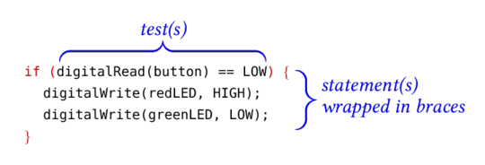
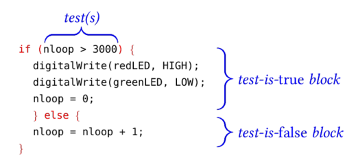

### Boolean Values ###

The Arduino language (and the `C++` language on which it is based) contain the datatype
`bool` (short for "Boolean")  which is the result of testing an expression.  Unlike 
`int` variables, which can take on any one of millions of values, 
a `bool` variable can take only one of two values: `true` or `false`.

Operators which produce Boolean values are:

| Operator             | Meaning                                                          |
|:--------------------:|:-----------------------------------------------------------------|
| `(x == y)`           | `true` if x is equal to y                                        |
| `!(x == y)`          | `true` if x is NOT equal to y                                    |
| `!(x)`               | `true` if x is false or 0                                        |
| `x > y`              | `true` if x is greater than y                                    |
| `x >= y`             | `true` if x is greater than or equal to y                        |
| `x < y`              | `true` if x is less than y                                       |
| `x <= y`             | `true` if x is less than or equal to y                           |
| `(expr1) && (expr2)` | `true` when `expr1` is `true` *and* `expr2` is `true`            |
| `(expr1) || (expr2)` | `true` when *either* `expr1` is `true` *or* `expr2` is `true`    |  

## Some example tests and their results ##

Suppose:

* `x = 1` 
* `y = 2`
* `z = 1.0`
* `pinState = LOW`

| Test                 | Result |
|:---------------------|:-------|
| `x > y`              | false  |
| `y > 2`              | false  |
| `x <= y`             | true   |
| `x`                  | true   |
| `pinState`           | false  |
| `x == z`             | false  |
| `(x > 0) && (x < y)` | true   |
| `(z) || (pinState)`  | true   |

⇒ The test (`x == z`) fails because `z` is a `float`, and floating point
numbers are NEVER represented *exactly* in a program, so `x` will be very slightly
different than `z`.

⇒ If `pinState` had been assigned the value `HIGH`, then the 
logical test `(pinState)` would be `true`.

### How to Write an `if` Statement ###

An `if` statement contains:

* one or more logical tests, and
* a statement (or a block of statements enclosed in curly braces) which will only
be executed if all of the logical tests are `true`

| Anatomy of an `if` statement |
|:----------------------------:|
|    |

The above statement tests whether some button was pressed, and, if so,
it turns one LED on and turns another off.

### How to Write an `if...else` Statement ###

An `if...else` statement contains:

* one or more logical tests, and
* a statement (or a block of statements enclosed in curly braces) which will only
be executed if all of the logical tests are `true`
* another statement (or a block of statements enclosed in curly braces) which will only
be executed if all of the logical tests are not `true`

| Anatomy of an `if...else` statement |
|:-----------------------------------:|
|      |

The above `if...else` statement tests whether a counter is larger than 3000, and,
if so, it turns a red LED on and a green LED off.  If the counter is smaller or equal
to 3000, then the counter is incremented by 1.

