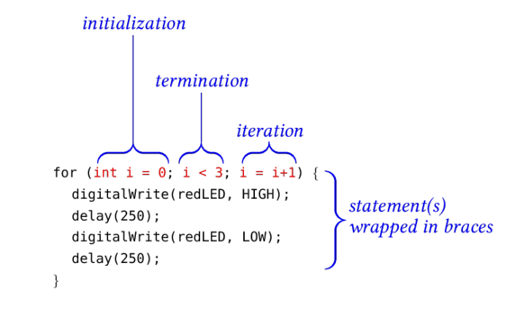
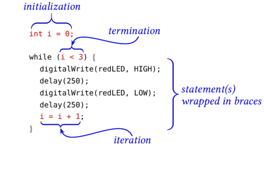

## Loops:  Repeating a Sequence of Commands ##

Every arduino program contains two functions:

* `setup()`, which is executed once, and
* `loop()`, which is executed again and again.

This packet is not about the *function* in your sketch named `loop`, 
but about any block of statements that should run again and again
util some condition is met.  Such blocks are called "loops".  They take
one of two forms:

* a block beginning with the keyword `for`, or
* a block beginning with the keyword `while`.

### `for` Loops ###

Use a `for` loop to execute a statement (or a block of statements) a certain number
of times, or until some condition is met.

| Anatomy of a `for` loop      |
|:----------------------------:|
|   |

The graphic above illustrates the three aspects of setting up 
a `for` loop:

> > **Initialization** (Set the Start condition): `int i=0`
> > : In this case, a counter was declared and initialized to 0.
> > 
> > **Termination** (Test the Stop condition): `i < 3`
> > : In this case, the termination statement tested whether the counter is less than `3`.
> > : The loop stops executing when this statement is `true`.  Any of the boolean 
> > : tests described in the packet on [conditional](../1e-conditionals) 
> > : statements can be used in the termination test.
> > 
> > **Iteration** (To-Do after every iteration): `i = i + 1`
> > : In this case, the counter is incremented by 1 just after every execution of
> > : all the statements in the block.
  
The programmer has a lot of freedom in choosing:
* which variable(s) to initialize and what initial value to give them,
* what statement(s) are executed within the loop
* what test(s) are used to determine whether the loop should be exited.

For example, this loop causes a function `blink()` to be called
again and again, *forever*, since there is no termination test:

    for ( ; ; ;) {
        blink();
    }

The next loop causes the function `blink()` to execute until the delay time
falls below a limit:

    for (delayTime = 1000; delaytime > 20; delayTime = delaytime * 0.5) {
        blink(RLED);
        blink(YLED);
    }
 
<!--
Order of Execution in a `for` Loop ###

In summary, the order of execution of the statements in a `for` loop is:

1.  The initial condition(s) is(are) executed once.

Thereafter, the following sequence of steps is repeated until the
termination test fails:

1.  The termination condition(s) is(are) tested.  If it evaluates to `true`, then
program jumps out of the loop.
2.  All of the statements in the block are executed.
3.  The iteration statement(s) is(are) executed.
-->

### `while` Loops ###

A block of statements can also be repeated under the control of `while`.

The keyword `while` is followed by an expression in parentheses which evaluates to `True` or `False`.  

A `while` loop is completely equivalent to a `for` loop if:

* the initialization condition(s) preceded the `while` loop, and
* the iteration conditions occur at the end of (but within) the `while` loop.

The figure below shows a `for` loop and its equivalent `while` loop:

| A `for` loop                 | An equivalent `while` loop    |
|:----------------------------:|:-----------------------------:|
|   |  |

