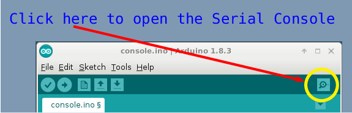
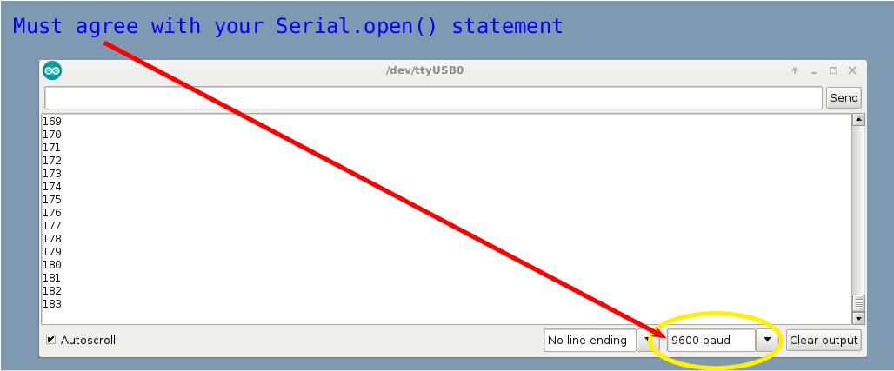

## Keyboard Interaction with an Arduino ##

Frequently, you'll need to see values being generated by your program or
read from a sensor in order to understand how your circuit and code are working.

Sometimes, you'll need to be able to *interact* with your Arduino, using 
values from your keyboard to affect how the program works.

To provide a way to see output from the Arduino, as well as provide input to it,
the arduino software includes commands to read/write from the *Serial Console*.
The Serial Console is just another window.  To open the Serial Console,
you must click the icon of a magnifying glass, located in
the right side of the arduino toolbar.

| Opening the Serial Console    |
|:-----------------------------:|
|         |                                |

⚠ Alert! Whenever you open the Serial Console, you will restart your arduino program.

When you open the console, you should see a new window like the one bewlow.

| The Serial Console             |
|:------------------------------:|
|          |

⚠ Alert! Not all Arduino boards support the Serial Console.  For example, 
Arduino boards with the Atmel ATTiny85 controller (like Adafruit's
[Trinket](https://www.adafruit.com/product/1501) do not support the Serial Console.  

### arduino functions for writing to the Serial Console ###

The arduino software provides 3 commands for writing values to the 
Serial Console.

`Serial.print()`
: This is the simplest command.  It takes one argument (which can be a literal value
: or a variable which holds a value), and can send that value to the Serial Console.
: Each time `Serial.print` is invoked, it displays a value immediately adjacent to 
: the previous value in the Serial Console.

`Serial.println()`
: This is the next simplest command.  It behaves exactly like `Serial.print`, except
: that when it is finished, any subsequent call to `Serial.print` or `Serial.println`
: will produce output on the **next** line.

The 3rd command for writing to the console, `Serial.write()` takes more 
general parameters and is not needed for this basic introduction. 

### arduino functions for reading from the Serial Console ###

The arduino software provides several commands for reading values from the 
Serial Console.  For the purposes of this introduction to the Serial Console,
only two are relevant:

`Serial.available()`
: This function returns `true` if some new keyboard input has been detected.
: Otherwise, it returns `false`.  Since even the slowest arduino statements
: take only about 5 msec, and since humans normally take at least 1 sec to
: input a keystroke, this function will return `false` most of the time, so
: it is essential to check the availability of new keyboard input before 
: you try read that input.

`Serial.parseInt()`
: This function interprets all the keyboard input that is possible as an
: integer, and returns that integer.  It ignores leading spaces or non-integer 
: values (like letters or other punctuation marks), and also ignores trailing 
: non-integer values, except that trailing spaces are interpreted as a single `0`.  

To input a value, place your cursor in the top window of the Serial Console,
then enter it and press the `ENTER` key on your keyboard, or click the `Send`
button.

