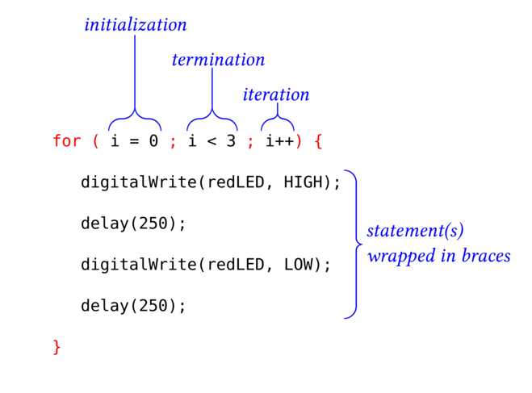

Use a `for` loop to execute a statement (or a block of statements) a certain number
of times.

### How to Write a `for` Loop ###

| Anatomy of a `for` loop      |
|:----------------------------:|
|   |

Initialization (Set the Start condition)
: In the example above, a counter is initialized to 0.

Termination (Test the Stop condition)
: In the example above, the termination statement tests whether the counter is
: less than `3`.   The loop stops executing when this statement is `true`.
: Any of the boolean tests described in the packet on [if-then](../1-if-then) statements
: can be used in the termination test.

Iteration (To-Do after every iteration)
: In the example above, increment the counter by 1 just after every execution of
: all the statements in the block.
  
### Order of Execution in a `for` Loop ###

The order of execution of the statements in the `for` loop is:

1.  The initial condition(s) is(are) executed once.

Thereafter, the following sequence of steps is repeated until the
termination test fails:

1.  The termination condition(s) is(are) tested.  If it evaluates to `true`, then
program jumps out of the loop.
2.  All of the statements in the block are executed.
3.  The iteration statement(s) is(are) executed.

