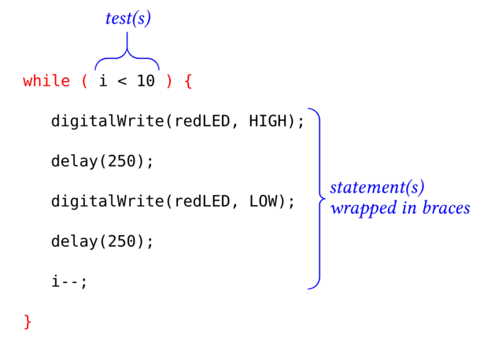

%
% Susan G. Kleinmann
% June 17, 2016

Use a `while` loop to execute a statement (or a block of statements) any number of
times until a set of conditions is satisfied.

### How to Write a `while` Loop ###

| Anatomy of a `while` loop      |
|:------------------------------:|
|   |

Unlike the `for` loop, the construction of a `while` loop does not require:

--any explicit initialization, or
: For example, the code in the diagram above is meaningless unless the counter used in the
: test was set beforehand.  For example, the whole loop could have been preceeded by:
:    i = 0;

--any explicit iteration statement.
: The statement `i++;` in the example above is shorthand for:
:    i = i + 1;
: The compiler does not require that statement; however, without that statement,
: the program will get stuck in an infinite loop.  

⚠ Alert!

`while` loops can run on forever unless the initialization
and iteration conditions are clearly and correctly defined.

