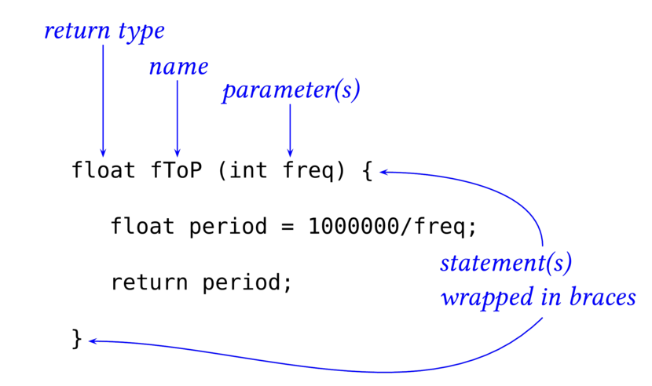
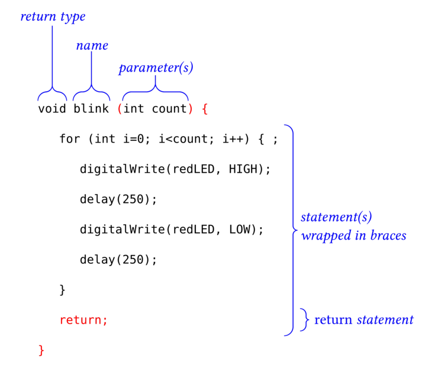

%
% Susan G. Kleinmann
% June 17, 2016

If you have written even one Arduino sketch, you have already written at least
two functions:  `setup()` and `loop()`.  When you compile a sketch, the Arduino software
looks for definitions of these two functions.  

You can add any number of additional functions to your sketch, and these 
additional functions will 
streamline your sketch and enable you to do much more complex things with your
Arduino.

<!--
## Using Functions to Simplify Your Code ##

Arduino programs *must* have definitions for two functions: `setup()`, and `loop()`.
However, you can define any number of additional functions.  Using functions will not
only streamline your program, but can also reduce errors, since
you will define specialized program behaviour in one place, rather than
re-inserting the same code over and over again in your main program.   

Like `setup()` and `loop()`, a user-defined function is just a block of 
statements enclosed in curly braces, `{...}`.  That block must have 
a distinct name (i.e., not `setup` or `loop`).  Meaningful names are
useful, e.g., `blink()`.  People often use long names consisting of 
more than one word, where the words are distinguished by capital 
letters (so-called "camelCase), e.g. `blinkJustOnceAfterReset()`.

-->

### How to Write a Function ###

<!--
The following simple function computes the period of a wave in units 
of microseconds, given its frequency.

Note that:

* the name of the function is `ftoP`
* the function takes one parameter, which it names `freq`
* the function returns a value which has the datatype `float`
* the function definition consists of 1 or more statements enclosed in curly braces
* every program statement ends in `;`

| Function Definition for `fToP()`      |
|:-------------------------------------:|
|            |
-->

The following function blinks an LED a certain number of times, depending on the
number `count` that is passed to it as an argument.

| Structure of a Function Definition    |
|:-------------------------------------:|
|            |

Note that:

* the function returns no value; the datatype of its return value is `void`.
* the name of the function is `blink`
* the function takes one parameter, which it names `count`; that parameter must be delivered by
  the caller as an `int`
* the function definition consists of 1 or more statements enclosed in curly braces.  Since
the above function contains a `for` loop, so it actually has 2 sets of curly braces.
* every program statement ends in `;`
; the `return` statement is optional in this case because the funtion's data type is `void`.

### How to Call the Function ###

Add the function to your sketch.  If it calls a global variable (as `blink` does), then
define that global variable *outside of any function* so that it is accessible to all
functions.

The following example shows the function `blink` being called from within 
the main `loop` function.

| Calling the function `blink()`      |
|:-----------------------------------:|
|             |

Note that:

* `blink` is called with exactly 1 argument 
* the type of that argument is `int`
* when `blink()` is finished executing, it returns control to `loop()`, which
then executes a long-ish delay, and then repeats the whole process.

<!--
Achtung!  It takes a lot of time for a processor to *call* a function.  The
processor has to set aside its current state (e.g., the address of the statement 
it last executed, the values of all the variables it knows about).  Then it 
has to "jump" to the memory location where the new function is defined, 
execute all the statements in that function, and finally re-load its state 
from before the function was called. 

➤ Design your functions carefully, to minimize the number of separate function calls.
-->
