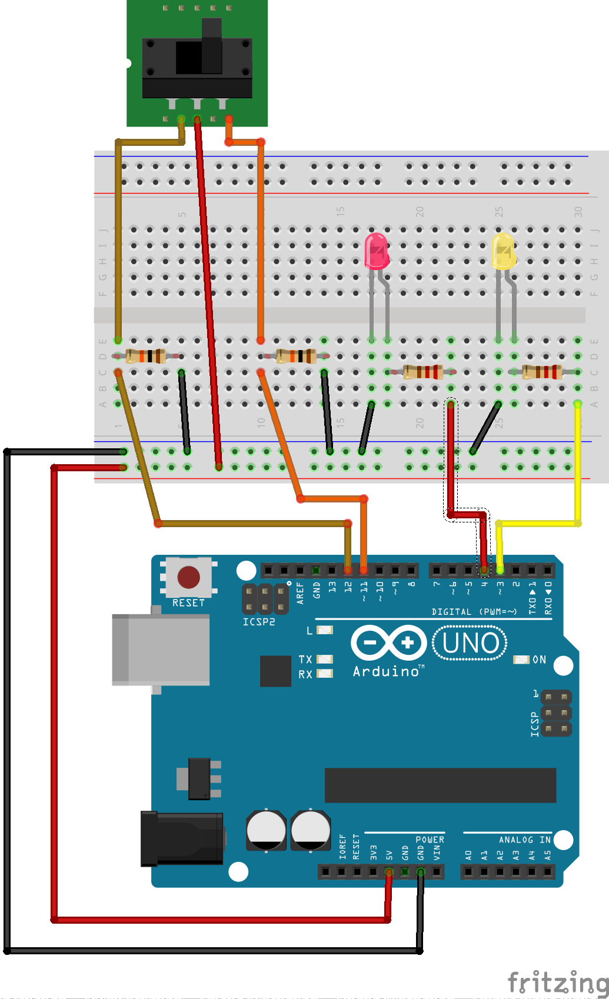

### Components of the Circuit ###

This circuit only needs:

* an Arduino board, and 
* a slide switch
* 2 high resistors, approximately 10KΩ
* 1 red LED
* 1 yellow LED
* 2 smaller resitors, approximately 330Ω

It is assumed that the board is powered through a USB cable (not shown in the circuit diagram).

### Layout of the Circuit ###

Attach one of the `GND` pins on the Arduino to the `GND` bus of the breadboard.

Attach the `5V` output pin of the Arduino to the power bus of the breadboard.

Attach the center pin of the slide switch to the power bus.

Attach each of the other pins of the slide switch to one side of a 10KΩ
resistor; attach the other side of the resistor to the `GND` bus.   Since one
side of these resistors is attached to `GND`, they are called "pull-down" resistors.
They ensure that when the switch does not activate one side, then that side 
has a well-defined voltage, i.e., `0V`.

Also attach each of the the non-center pins of the slide switch to one of the
digital pins on the Arduino.

Insall 2 LEDs in the same way shown in [packet 1b](../../1-LED/1b-ExternalLED),
i.e., attach the positive side to one of the digital pins on the Arduino, 
and attach the negative side to a small (330Ω) resistor; then attach the other
side of that resistor to ground.

| A Slide Switch with Two LEDs           |
|:--------------------------------------:|
|    |

