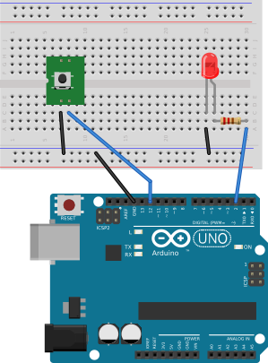

## Using a Swtich to Control a Single LED ##

The following circuit shows:

* a pushbutton switch which is connected to the `GND` bus of a 
breadboard and to one of the digital I/O pins on an Arduino UNO

* three LEDs whose anodes (`+`) are connected to various digital I/O pins on an Arduino boards,
and whose cathodes (`-`) are connected to one end of a 220Ω resistor.

* three 220Ω resistors, each connected between the cathodes of an LED and the
`GND` bus of the breadboard.

| Pushbutton and LED connected to an UNO |
|:--------------------------------------:|
|     |

