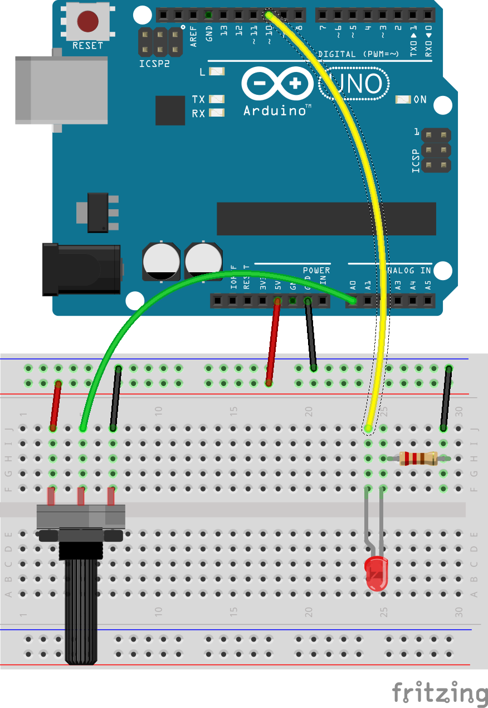

## Circuit to Control an LED with a Potentiometer ##

The components of the circuit are:

* an Arduino board with at least one Analog I/O pin
* a potentiometer
* an LED
* a 220Ω resistor

The circuit is shown below.  

| Combining a TrimPot with an LED            |
|:------------------------------------------:|
|  |

When you add the trimpot to your breadboard, be sure to attach its 
center pin to one of the digital I/O pins of the Arduino.  
Then one of the other pins (it doesn't matter which one) can be attached 
to `GND` and the remaining pin on the pot should be attached to `5V`.  

