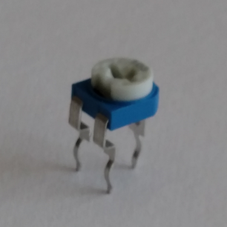
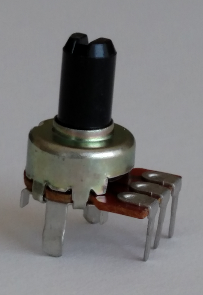

## What is a Potentiometer? ##

A "pot" or "potentiometer" is a variable resistor.  Rather than having a fixed value
like 220Ω or 10KΩ, a potentiometer can take on any range of values between 0 and
the value for which it is rated (e.g., 0 to 10KΩ).  Usually, the resistance of
a pot is varied by turning a screw or a handle.  

Two common types of pots are:

trim pot
: Useful where the optimum setting needs to be made once or infrequently (e.g., an 
: LED screen background).  It is meant to be adjusted with a little screwdriver.

panel mount pot
: Useful where the setting will be made frequently by turning a (big) knob (e.g.,
: the volume or station setting on a radio).

| Trim Pot                | Panel Mount Pot               |
|:-----------------------:|:-----------------------------:|
|  |  |

This packet shows how to use a pot to change the state of an LED.
One example shows how to make the LED brighter or fainter; another shows how
to make the LED blink faster or slower.

