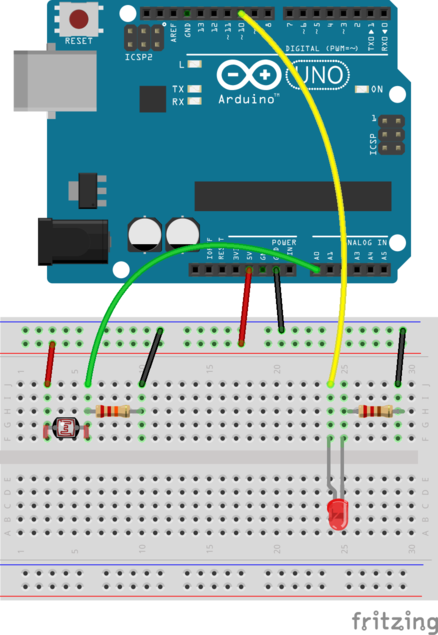

## Circuit to Control an LED with a CdS Light Sensor ##

The components of the circuit are:

* an Arduino board with at least one Analog I/O pin
* a CdS light sensor
* an LED
* a 220Ω resistor

The circuit is shown below.  

| Combining a TrimPot with an LED            |
|:------------------------------------------:|
|  |

Since the CdS sensor is just a resistor, it doesn't matter which
orientation you use; either pin can be attached to `5V`, and the
other one should be attached to a resistor whose other end is
attached to `GND`.

