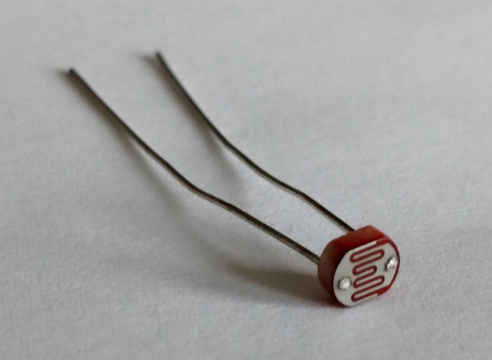

## A Simple Light Sensor ##

Probably the most widely used light sensor (maybe even the most widely
used sensor of any type) on Arduino boards is a CdS (Cadmium Sulfide)
photoresistor like the one shown below:

| A CdS light sensor  |
|:-------------------:|
|  |

The resistance of these devices decreases when light falls on them.

These resistors are very inexpensive, and not terribly consistent:  two
different CdS cells will likely respond differently to the same light
conditions.  They are, however, very inexpensive and reasonably rugged.

This packet shows how to use light shining on a CdS cell to change the
voltage read on an analog pin, and then to use that reading to turn an
LED on or off.

