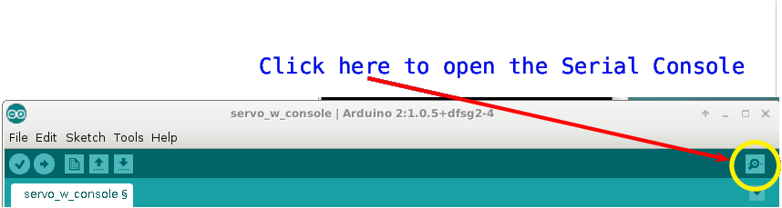
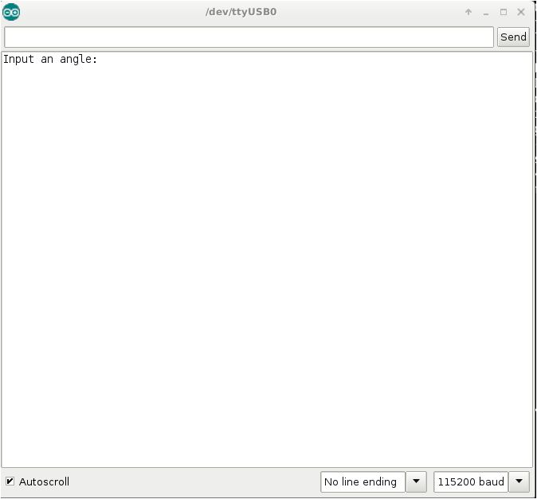

## Controlling Arduinos with Sensors ##

The packets in this section will be about using various devices 
as *inputs* to an Arduino, in order to control one or more output devices.

* Packet 3 on [pots](3c-potentiometers) shows how to use a potentiometer to control 
the position of a servo motor.

* Packet 4 illustrates a common (albeit low quality) [light sensor](3d-light-sensor).

* Packet 5 on using a [PIR (passive InfraRed](3e-proximity-sensor) proximity sensor
shows how to turn on and LED when motion is detectted.

## Getting Input and Output ##

It is often useful, and sometimes necessary for the user to see the output of
a sensor, and it is sometimes important for the circuitry to get real human input
(e.g. the code might ask the user which light to turn on).  To support user I/O,
the Arduino software provides access to a "Serial Console", which is just another
window.  In this other window, the Arduino can be programmed to write output,
either directly from a sensor, or just some other output generated by your program.
The Serial Console can also be used to query the user for input.

So this section begins with
* a packet that shows how to [open the Serial Console](3a-output), and how to write output to 
the Serial Console, and
* a packet that shows how to use the Serial Console to prompt the user for input, and
then incorporate that [user input](3b-input) into your program.

### How Can I Open the Serial Console? ###

Click the serial console button on the upper-right side of the Arduino GUI.

| Open the Serial Console By Clicking the Magnifying Glass Icon |
|:-------------------------------------------------------------:|
|                                         |

### What will the Serial Console look like? ###

Arduino's "Serial Console" is an extra graphical window, that shows up outside
of the original Arduino GUI.  A picture of the console is shown below.

| An Open Serial Console                   |
|:----------------------------------------:|
|                    |

