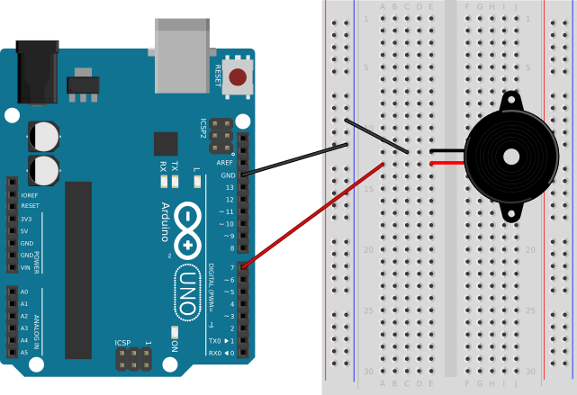

### Components of the Circuit ###

This circuit only needs:

* an Arduino board, and 
* a piezo-electric buzzer.

It is assumed that the board is powered through a USB cable (not shown in the circuit diagram).

### Layout of the Circuit ###

Attach one of the `GND` pins on the Arduino to the `GND` bus of the breadboard.

Attach one lead of the buzzer to one of the digital I/O pins on the Arduino board.

Attach the other lead of the buzzer is attached to the `GND` bus on the breadboard.
Arduino board.

The circuit shows two different colors for the wires from the buzzer.  Piezo electric
buzzers are polarized, so it is important that the orientation of the buzzer should
match what is shown in the circuit.

| Piezo buzzer attached to Arduino Board |
|:--------------------------------------:|
|           | 

