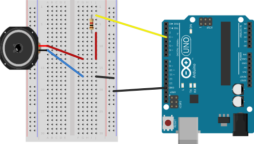
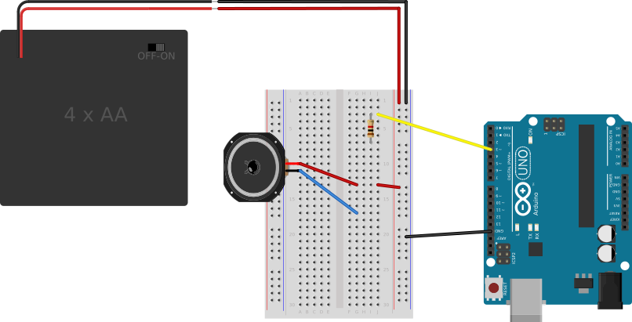
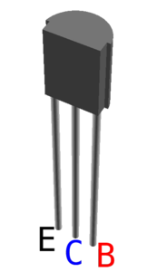
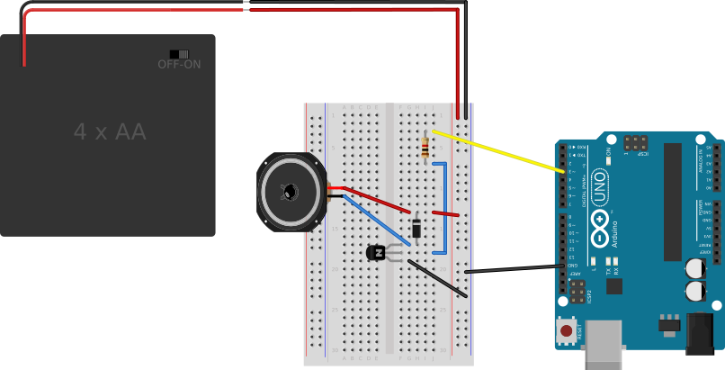

%
% Susan G. Kleinmann
% June 26, 2016

The components required for this circuit are:

* an Arduino board,
* a piezo-electric buzzer or a speaker,
* a current-limiting resistor, e.g., 1kΩ,
* a battery pack or some additional source of power, and
* a transistor

The following diagrams introduce these circuit elements one at a time.

#### Add the Resistor ####

Attach one end of the resistor to a digital I/O  pin on the Arduino.
Attach the other end to the `+` side of the speaker.  The `-` side of the
speaker should remain attached to the `GND` bus.

This resistor is not necessary (or even helpful) with a small piezo buzzer, 
but it is absolutely critical if you have a typical 4-Ohm or 8-Ohm speaker.

<!--
Caution!  Do NOT connect the battery in this circuit unless your speaker has a resistance
of 300 Ohms or more!  (To use the more common, low resistance speakers, see the next step.)
-->

| Speaker Connected through a Resistor       |
|:------------------------------------------:|
|   |

#### Add Battery ####

Attach the `-` side of an external battery pack to the `GND` bus of the breadboard,
and attach the `+` side of the pack to the power (`+`, red) bus of the breadboard.
(This battery pack will power the speaker (but not the 
Arduino itself, which will still be powered by the USB bus.)

Connect the `+` terminal of the speaker to the `+` bus of the breadboard.

The resistor will be (temporarily) unattached at one end.

| Speaker Powered by External Battery               |
|:-------------------------------------------------:|
|  |

#### Add the transistor ####

Explanation:  The transistor acts like a gate for current flowing to 
the speaker.  When the I/O pin on the Arduino goes `HIGH`, current flows through 
the resistor to the center pin (a.k.a. the "base") of the transistor.  This
then opens up the "gate" (aka, the "base"), allowing current to flow through the transistor
from its "high" side (the "collector") to its ground side (the "emitter").

Wiring:  First, insert the transistor into the breadboard, with the flat side 
facing the Arduino.

Connect the loose end of the resistor to the center pin of the transistor.

Connect the low (black) wire of the speaker to the upper end of the transistor.

Connect the lowest pin on the transistor to the `GND` bus on the breadboard.

The circuit with the speaker connected to the transistor is shown below:

| Speaker Power Controlled by a Transistor               |
|:------------------------------------------------------:|
|   |

For reference, the specific transistor used in this circuit is a PN2222.  
The labels for its Emitter, Base, and Collector are shown below:

| Pinouts for the PN2222           |
|:--------------------------------:|
|   |

<!--
#### Add a Zener Diode ####

A Zener diode can be added to the circuit for over-voltage protection. 

| Finished Circuit                      |
|:-------------------------------------:|
|   |
-->
