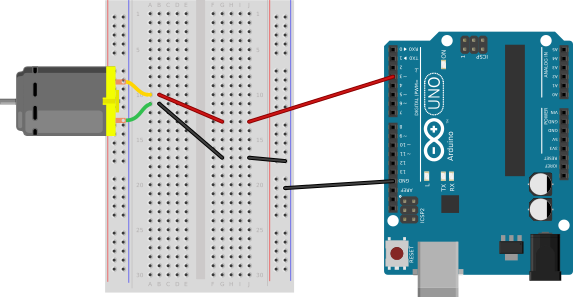
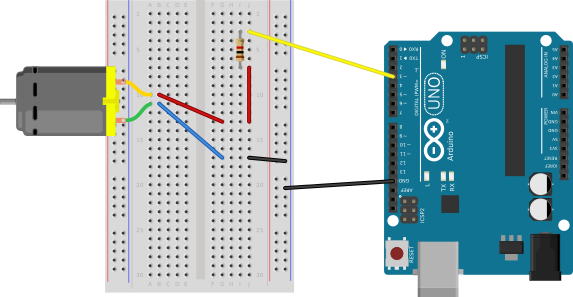
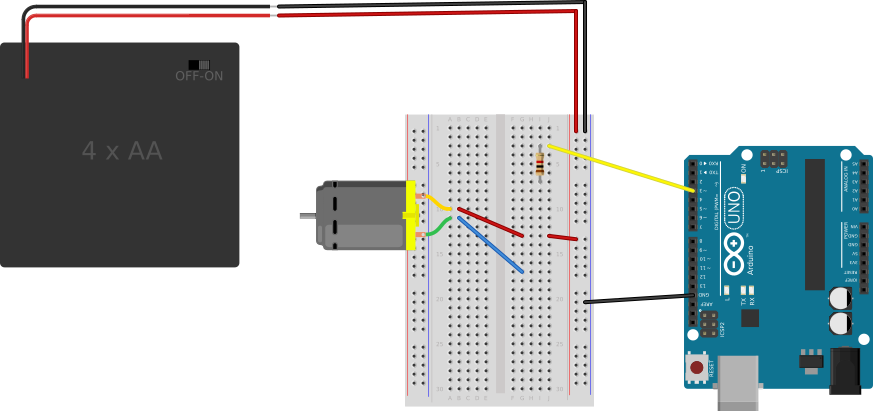
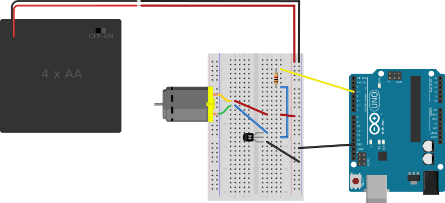
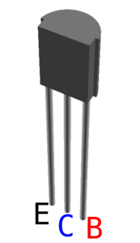
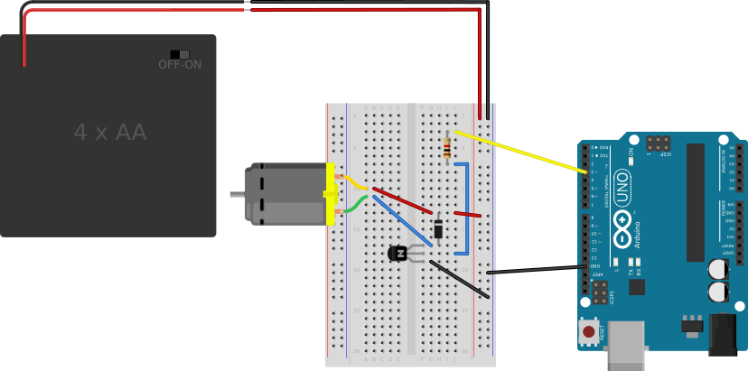

%
% Susan G. Kleinmann
% June 26, 2016

The components required for this circuit are:

* an Arduino board,
* a DC motor,
* a current-limiting resistor, e.g., 1kΩ,
* a battery pack or some additional source of power, and
* a transistor
* a zener diode

This circuit will look *exactly* like the [circuit for the 8Ω speaker](../../3-Sound/3d-speakers/circuit.html), with
two exceptions:

* even though both circuits use Pin 3 of the Arduino for control, in this case, Pin 3 will be used
for analog output (PWM) rather than digital output.
* there is a Zener diode across the terminals of the motor to protect the circuit from voltage spikes.
See more about Zener diodes [here](http://www.evilmadscientist.com/2012/basics-introduction-to-zener-diodes/).

The following diagrams introduce these circuit elements one at a time.

### Insert the Motor ###

The motor is not polarized, so you can treat either connection as `+`.

So attach one connector to the `GND` bus of the breadboard, and attach that bus to one of
the `GND` connectors on the Arduino.

(You can attach the other end of the motor to a PWM pin at this point, as shown in the
picture, but unless you are sure your motor will not draw more than 20mA from the Arduino,
it's probably not a great idea to do that.)

| Making the First Motor Connections   | 
|:------------------------------------:|
|    |

### Add the Resistor ###

Attach one end of the resistor to a PWM  pin (i.e., any pin marked with "~") on the Arduino.

Attach the other end to the side of the motor being used as the `+` side.  (The `-` side of the
motor should remain attached to the `GND` bus.)

| Motor with Resistor                     |
|:---------------------------------------:|
|  |

### Add Battery ###

Attach the `-` side of an external battery pack to the `GND` bus of the breadboard,
and attach the `+` side of the pack to the power (`+`, red) bus of the breadboard.
(This battery pack will power the motor (but not the 
Arduino itself, which will still be powered by the USB bus.)

Connect the `+` terminal of the motor to the `+` bus of the breadboard.

The resistor will be (temporarily) unattached at one end.

| Motor Powered by External Battery               |
|:-------------------------------------------------:|
|  |

### Add the transistor ###

Explanation:  The transistor acts like a gate for current flowing to 
the motor.  When the I/O pin on the Arduino goes `HIGH`, current flows through 
the resistor to the center pin (a.k.a. the "base") of the transistor.  This
then opens up the "gate" (aka, the "base"), allowing current to flow through the transistor
from its "high" side (the "collector") to its ground side (the "emitter").

Wiring:  First, insert the transistor into the breadboard, with the flat side 
facing the Arduino.

Connect the loose end of the resistor to the center pin of the transistor.

Connect the low (black) wire of the motor to the upper end of the transistor.

Connect the lowest pin on the transistor to the `GND` bus on the breadboard.

The circuit with the motor connected to the transistor is shown below:

| Motor Power Controlled by a Transistor               |
|:----------------------------------------------------:|
|   |

For reference, the specific transistor used in this circuit is a PN2222.  
The labels for its Emitter, Base, and Collector are shown below:

| Pinouts for the PN2222          |
|:-------------------------------:|
|  |

### Add a Zener Diode ###

A Zener diode can be added to the circuit to protect the components from voltage spikes
when the power is turned off.

| Finished Circuit                      |
|:-------------------------------------:|
|   |
