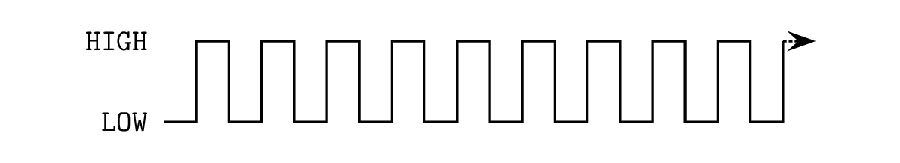

## Produce Sound with a Piezoelectric Buzzer  ##

This packet shows how to create sounds on a simple piezoelectric buzzer.

The technique used is *almost* the same as that used to [blink
an external LED](../../1-LED/1b-ExternalLED).  The difference is:

* the LED turns `ON` when you set the I/O pin to which its 
connected `HIGH` (using `digitalWrite(HIGH)`).
* the buzzer makes a sound not when the I/O pin is `HIGH` or `LOW`,
but only when the I/O pin is *changed* from `HIGH` to `LOW` or vice versa.
The reason is that a sound wave is caused not by the amount of 
air pressure on your ear, but by the vibration of that pressure.

The frequency of the vibration determines the pitch of the sound you hear. 
For example, a vibration in air pressure that occurs at 440 times per second produces
the sound of a "Middle A" on the piano.  (Well, a real piano has beautiful overtones, 
not just a simple single-frequency sound wave.)

So, the goal of this packet will be to change the state of a buzzer, from 
`LOW` to `HIGH` and back again, fast enough to cause a vibration that can be
detected by your ear.  

### What Speed of Air Vibrations Can You Hear? ###

Supposedly, humans can hear air vibrations as slow as 20 per second and as
fast as 20,000 per second.  Vibrations faster than that are called ultrasound.
Elephants can hear much slower vibrations; insects can "hear"  much faster ones.

The unit "per second" is also call "Hertz", abbreviated "Hz".
Middle A on the piano corresponds to a pressure vibration occurring 440 times 
per second; it is therefore said to have a frequency of 440 Hz.

The period of a wave is the time to complete the full cycle of 1 vibration.  

| The Period of a Square Wave         |
|:-----------------------------------:|
|  |

The period of a wave is simply related to its frequency:

    Period = 1 / frequency

So, "Middle A" on a piano produces a sound wave with a period of:

    Period = 1 / 440 Hz
	   = 0.002727 seconds
	   = 2.7 milliseconds

⇒ If you change the voltage through the buzzer approximately every 2.7 msec, 
then you should hear a "Middle A" sound.

### How Many Changes are Necessary?  ###

To produce Middle A for 1s, change the voltage 
through the buzzer (from `LOW`to `HIGH` and `HIGH` to `LOW`) 440 times.  
In other words:

    Number of square waves needed = (Desired Duration of Sound) / (Period)

Let's say you wanted to hear "Middle A" for 0.3 seconds.  Then

    Number of square waves = 0.3 sec / 2.7 msec
                           = 132

Obviously, it takes many more waves to make a high frequency sound for the same duration
as a low frequency sound:

| A Low Frequency Wave            |
|:-------------------------------:|
|       |

| A High Frequency Wave           |
|:-------------------------------:|
|  |

You will *definitely* want to use a `for` loop to make these vibrations!!!!

