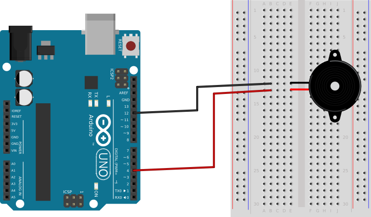

## A Buzzer Circuit with Louder Sound ##

The circuit for this packet uses just:

* an Arduino board, and
* a piezo-electric buzzer

The circuit is almost identical to the that in the [DIYSquareWave](../3a-DIYSquareWave/circuit.html) packet.

| Double the Power through a Buzzer with this Circuit |
|:---------------------------------------------------:|
|                  |
