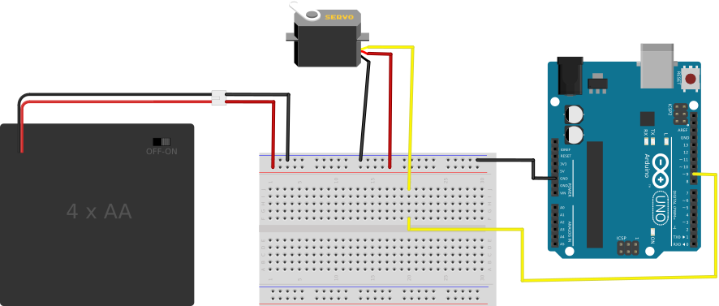

## Servo Wiring ##

Hobby servo motors have 3 wires:

* a red wire which should be attached to the positive voltage source.  For smaller
servos which are not driving a big load, it *may* be sufficient to attach this wire 
to the +5V pin on an Arduino board.  For larger servos it is always necessary to attach
this wire to the positive terminal of some larger power source (like a 6V or 12V battery).

* a black wire which should be attached to `GND`.

* a wire of some other color (white/orange/yellow...) which should be attached to
one of the PWM I/O pins on the Arduino.

The Fritzing diagram for this simple connection is shown below:

| A Micro-Servo Attached to an Arduino |
|:------------------------------------:|
|          |

Note! The control line of the servo is attached to Pin 9.  This pin, or pin 10,
are the preferred I/O control lines for servos, because the Servo library
that will be used for this example disables PWM on those pins anyway.
So, by using Pin 9 (or Pin 10) you don't lose any functionality that you would
otherwise have had.

Also note that the power for the servo is provided by an external battery.  The reason
is that the servo (especially, servos turning a big load, or large (so-called "1/4 scale" or 
"Mega"-scale servos) will draw much more current than can safely be delivered through
the I/O pins of the Arduino.  

The Arduino itself is assumed to be powered through its USB port or through another 
external battery.

ESSENTIAL:  The Arduino, the servo, and the external battery MUST be connected to
the same `GND` bus.  In short:

* a component can get its power from anywhere that can supply sufficient current and voltage, but
* every component in a circuit must be tied to the same ground

