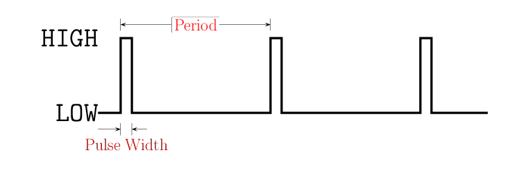

<!--
Hobby servo motors are often used to control RC cars and toys, have
many advantages:

* inexpensive: some are as cheap as \$1.

* widely available at hobby stores and online (and also, of course, inside toys).

* easy to wire up, because theiy only have 3 wires, one for power, one 
for `GND`, and one for control.

and some disadvantages:

* Position feedback control is not so accurate as that on costly industrial servos,
and there is little control over speed.
-->

<!--
The types of servos that are normally used in Radio Controlled cars and planes
are usually sold in "kits", which include not just the motor, but also a collection of
"findings", which are screws, eyelets and rubber grommets, as well as "horns" 
which make it convenient to attach other devices to them.   
In case you lost yours or want more, all of these add-ons are also available 
separately.  Also available are larger horns and brackets to mount the servo firmly 
in place.
-->

Hobbyists use servo motors to control RC cars and similar toys.  By comparison to
industrial-strength servos, hobby servos are relatively cheap and much simple to 
install in a circuit.  However, they do not offer the degree of control that can be
expected of an industrial servo, nor can they exert as much power.

Hobby servos come in two types:

a.  Servos that can turn a spindle to any position within a fixed range, typically 0° to 180°;
the position can be controlled.
b.  Servos that can turn a spindle continuously, aka "continuous rotation servos"; their speed, 
but not the position can be controlled.

This packet focusses on ordinary servos whose position (but not speed) are under your control.

Controlling a hobby servo is done by sending it a series of pulses, and then 
changing ("modulating") the width of those pulses in order to make its
shaft rotate to a different position.  This technique is called "Pulse Width Modulation"
(i.e. PWM).

#### A Pulse Wave is a Like a Square Wave ####

Square waves were introduced in the packet on 
[DIY_Square Waves](../../4-Sound/4a-DIYSquareWave).
Square waves are LOW for half a period, and HIGH for half of its period.
A pulse wave, in contrast, is LOW for most of its period, and HIGH for a small
fraction of its period, as shown below.

| A Pulse Wave               |
|:--------------------------:|
|  |

#### Pulse Waves for Servos ####

The electronics inside hobby servos expect to see a pulse every 20 msec.  The 
*width* of the pulse tells the servo its target position.  The plot
below shows three pulse waves where the pulses have different widths.  When the
servo motor detects the first pulse train (with its sequence of short, 1.0msec pulses), 
it moves to turns its spindle to 0°.  
When it detects the second pulse train (with its sequence of medium, 
1.5 msec pulses) it moves to 90°.  
When it detects the third pulse train (with its sequence of long, 
2.0 msec pulses) it moves to 180°.  

| 1.0 ms Pulse Wave (0°) |
|:-----------------------------:|
|          |

| 1.5 ms Pulse Wave (90°)|
|:-----------------------------:|
|         |

| 2.0 ms Pulse Wave (180°)|
|:-------------------------------:|
|           |

Unless the servo has been "modded" to allow rotation beyond the range 0° through 180°, 
then its response to narrower or wider pulses is undefined (may be different for
different servos).

