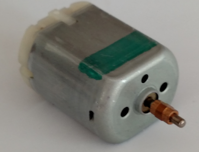
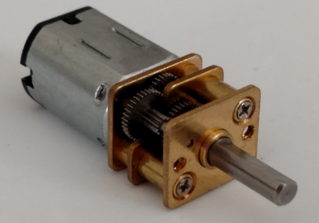

## DC Motors ##

Motors like the ones pictured above are inexpensive and commonly 
available at hobby shops.

| A Toy DC Motor            | A Geared DC Motor            |
|:-------------------------:|:----------------------------:|
|  |  |

They have little control--typically, you can make them
go fast (hundreds of rpm) and faster. If you need a slow DC motor, 
then you may want a geared motor like the one on the right.

There is no position control at all with these types of motors.

This packet shows you how to wire up and program either type
of DC motor using an Arduino.

### Circuit Requirements of DC Motors ###

Like speakers, DC motors can require a lot of power.  In general, the 
current provided by a digital I/O pin on an Arduino is insufficient
to provide this power.

To solve this problem, as in the case of the [8Ω speaker](../../4-Sound/4d-speakers/index.html),
the Arduino is used not to control the power on the motor, but to control the power on
a transistor which is a gate between an external power supply and the motor.

### Code Requirements of DC Motors ###

