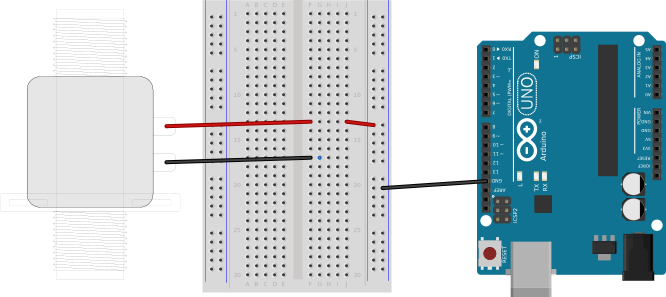
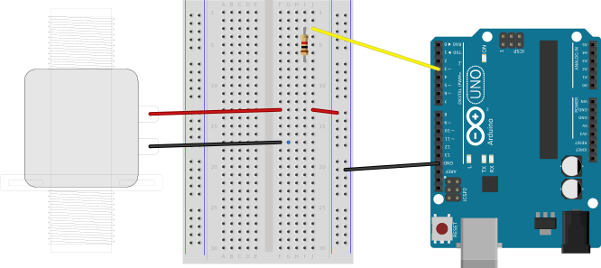
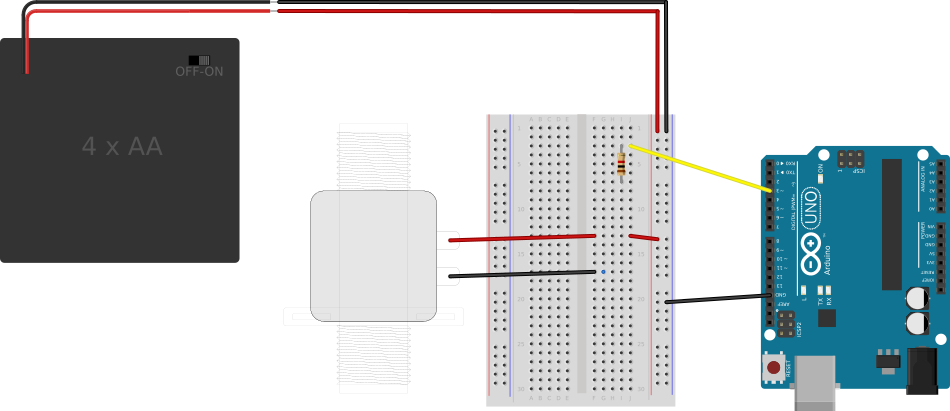
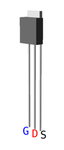
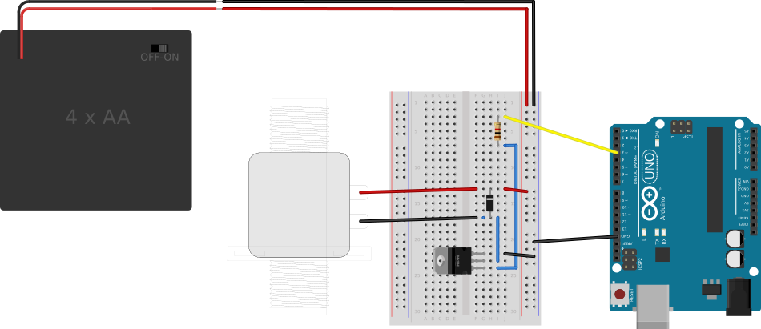

## Circuit to Drive a Solenoid Motor ##

The components required for this circuit are:

* an Arduino board,
* a DC motor,
* a current-limiting resistor, e.g., 1kΩ,
* a battery pack or some additional source of power, 
* a logic-level power MOSFET (i.e., one for which the drain current is high enough
for your purposes, even when the gate-to-source voltage is only 5V), and
* a zener diode

This circuit will look *a lot* like the [circuit for the toy motor](../4c-DC-Motors/circuit.html), 
with the exception:

* Pin 3 will be used for digital output rather than analog (PWM) output.
* the pinouts for the MOSFET (used to control current from the power supply to the solenoid)
differ from the pinouts of the transistor used to control power to the toy DC motor.

The following diagrams introduce these circuit elements one at a time.

### Insert the Solenoid ###

The solenoid is not polarized, so you can treat either connection as `+`.

Attach one connector of the solenoid to the power (red) bus of the breadboard.

Do not yet attach the other (`GND`) connector of the solenoid.  But DO attach the `GND`
bus of the breadboard to a `GND` pin on the Arduino.

| Making the First Solenoid Connections   |
|:---------------------------------------:|
|    |

### Add the Resistor ###

Attach one end of the resistor to a PWM  pin (i.e., any pin marked with "~") on the Arduino.

Do not yet attach the other end of the resistor.

| Solenoid with Resistor                     |
|:------------------------------------------:|
|  |

### Add Battery ###

Attach the `-` side of an external battery pack to the `GND` bus of the breadboard,
and attach the `+` side of the pack to the power (`+`, red) bus of the breadboard.
(This battery pack will power the motor (but not the 
Arduino itself, which will still be powered by the USB bus.)

Connect the `+` terminal of the motor to the `+` bus of the breadboard.

| Solenoid Powered by External Battery               |
|:--------------------------------------------------:|
|  |

### Add the power MOSFET ###

Explanation:  The MOSFET acts like a gate for current flowing to 
the motor.  When the I/O pin on the Arduino goes `HIGH`, current flows through 
the resistor to the "Gate" of the MOSFET.  This open gate then allows 
current to flow through the MOSFET from its "high" side (the "Drain") 
to its ground side (the "Source").

Wiring:  First, insert the MOSFET into the breadboard, with the labelled side 
facing the Arduino (or the metal backing facing away).

Connect the loose end of the resistor to the furthest pin of the MOSFET.

Connect the middle (black) wire of the solenoid to the center pin of the MOSFET.

Connect the highest pin on the MOSFET to the `GND` bus on the breadboard.

The circuit with the motor connected to the transistor is shown below:

| Solenoid Power Controlled by a MOSFET                   |
|:-------------------------------------------------------:|
|   |

For reference, the specific MOSFET used in this circuit is a NTD4806N.  
The labels for its Gate, Source and Drain are shown below:

| Pinouts for the NTD4806N        |
|:-------------------------------:|
|  |

### Add a Zener Diode ###

A Zener diode can be added to the circuit to protect the components from voltage spikes
when the power is turned off.

⚠Alert!  Zener diodes have polarity!  Make sure the silver band is connected to the positive
voltage side of the solenoid.

| Finished Circuit                       |
|:--------------------------------------:|
|   |
