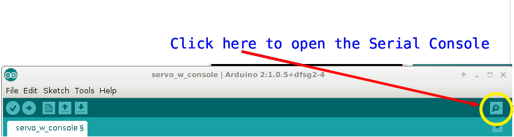
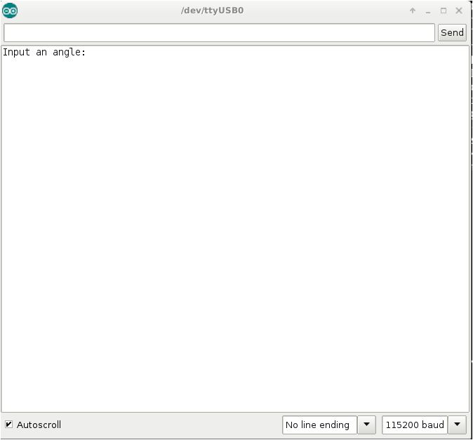

%
% Susan G. Kleinmann
% June 27, 2016

The Arduino programming environment provides for some user input and output
by its "Serial Console".  Packets in this group show you how to use that
console.

### How Can I Open the Serial Console? ###

Click the serial console button on the upper-right side of the Arduino GUI.

| Open the Serial Console By Clicking the Magnifying Glass Icon |
|:-------------------------------------------------------------:|
|                                         |

### What will the Serial Console look like? ###

Arduino's "Serial Console" is an extra graphical window, that shows up outside
of the original Arduino GUI.  A picture of the console is shown below.

| An Open Serial Console                   |
|:----------------------------------------:|
|                    |

