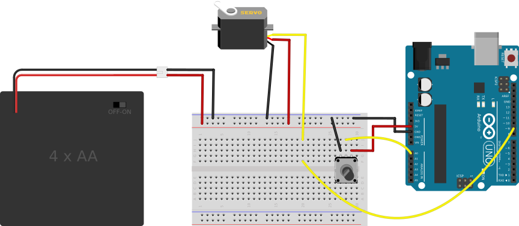

## Circuit to Control a Servo with a Potentiometer ##

The components of the circuit are:

* an Arduino board with at least one Analog I/O pin
* a servo motor
* an external source of power, like a battery pack
* a pot

The circuit is shown below.  

| Combining a TrimPot with a Servo           |
|:------------------------------------------:|
|  |

Connect the Arduino, servo and battery as in the 
[introductory packet on servos](../../4-Motors/4a-Servo-Set-Position/circuit.html).

Then add the trimpot anywhere on your breadboard, with the following connections:

* Connect the center pin to one of the analog pins (labelled "A0", ...) on the Arduino.
* Connect one of the other pins (it doesn't matter which one) to the `GND` bus on the breadboard.
* Connect the other pin to the regulated `5V` output on the Arduino.

