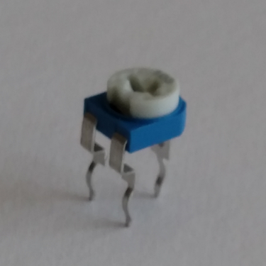
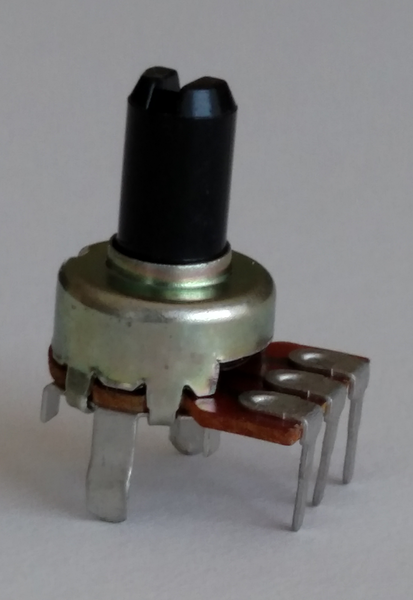

%
% Susan G. Kleinmann
% June 22, 2016

### What is a Pot? ###

A "pot" or "potentiometer" is a variable resistor.  Rather than having a fixed value
like 220Ω or 10KΩ, a potentiometer can take on any range of values between 0 and
the value for which it is rated (e.g., 0 to 10KΩ).  Usually, the resistance of
a pot is varied by turning a screw or a handle.  

Two common types of pots are:

trim pot
: Useful where the optimum setting needs to be made once or infrequently (e.g., an 
: LED screen background).  It is meant to be adjusted with a little screwdriver.

panel mount pot
: Useful where the setting will be made frequently by turning a (big) knob (e.g.,
: the volume or station setting on a radio).

| Trim Pot                | Panel Mount Pot               |
|:-----------------------:|:-----------------------------:|
|  |  |

This packet shows how to use a pot to change the position setting of a servo motor.
When the pot and Arduino are correctly configured, turning the pot will have the 
effect of changing the width of the pulse wave being sent to the servo, which 
will change its position angle.

### Digital Reading and Writing Isn't Enough! ###

The Arduino functions `digitalWrite()` and `digitalRead()` can only 
output the values 0V or 5V and sense the values `LOW` and `HIGH`.

<!--
output and
input "digital" values.  As a result:

* On a 5V board (most UNO's), when an I/O pin is being read:

> * any input value over 3V is interpreted by the microprocessor as a `HIGH` value, and 
> * any input value under 2V is interpreted by the microprocessor as a `LOW` value.

* On a 5V board, when an I/O pin is being written to:

> * a `HIGH` value is output as 5V, and
> * a `LOW` value is output as 0V.
-->

This range of input and output values is insufficient for an application like controlling
a servo, where you are using a variable resistor to set the servo motor to *any* angle 
between 0 and 180°.  For that you need analog input (to read the voltage
across a pot) and analog output (to set the position angle for the servo).

### Reading and Writing Analog Values ###

To input (read) analog signals on an Arduino, use
: pins labelled A0-A5 (on an Arduino UNO) are used for analog input.
:
: `analogRead()` on one of these pins converts an input voltage (using an 
: analog-to-digital converter in the microcontroller) to a digital value between 0 and 1023.

To output (write) analog signals on an Arduino, use
: digital pins with numbers having a tilde (~) above or beside the pin number).
: On an UNO, the pins that can be used for analog output are 3, 5, 6, 9, 10, and 11.  
:
: `analogWrite()` to one of these pins simulates an analog value by using
: a technique called [Pulse Width Modulation](/glossary/PWM.html).
:
