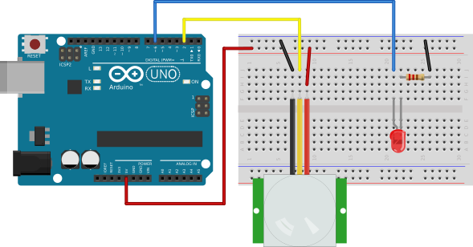

%
% Susan G. Kleinmann
% June 24, 2016

## Components of the Circuit ##

The components of the circuit are:

* an Arduino board 
* a PIR sensor
* an LED
* a current-limiting resistor, about 220Ω

The circuit is shown below.  

| Controlling an LED with a PIR Sensor       |
|:------------------------------------------:|
|  |

