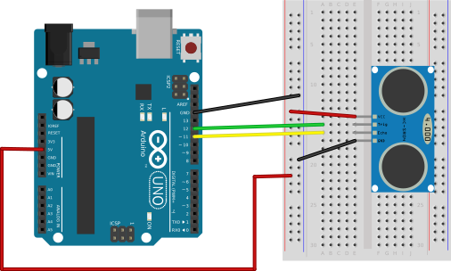

%
% Susan G. Kleinmann
% July 7, 2016

The components required for this circuit are:

* an Arduino
* an HR-SR04 ultrasonic sensor

The sensor requires only about 2mA of current, and therefore
can be powered directly from the `5V` output line of the Arduino.

| Connecting the HC SR-04 Ultrasonic Sensor |
|:-----------------------------------------:|
|             |

