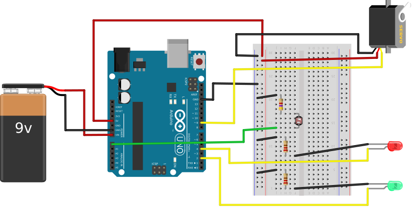

## Bill of Materials ##

The laser pointer requires:

* a laser dot diode module
* a 3V-5V battery pack with connection wires and a switch

The sensor/motor circuit requires:

* an Arduino board (just about any board will do)
* a servo motor
* any visible light sensor (even a CdS photocell)
* a red LED with long (~6-8") leads 
* a green LED with long (~6-8") leads 
* 2 current-limiting resistors for the LEDs, each 220Ω
* 1 resistors for the light sensor, about 10kΩ.
* a 6-9V battery pack.
* an 8" x 8" square of  square of pegboard 
* a block of wood to stabilize the pegboard in the vertical direction,
~1-2" high by 8" long by 2-3" wide  
* 2 L-brackets with screws to attach the wooden block to the pegboard
* a wooden or plastic dowel to be attached to the shaft of the motor
* a flag made out of construction paper to be attached to the opposite end of the dowel

## Making the laser pointer ##

Attach the red wire on the laser module to the red wires on the battery pack.

Attach the black wire on the laser module to the black  wire on the battery pack.

## Making the sensor/motor circuit ##

Connect the red and green LEDs, the light sensor, and the servo motor as 
shown in the diagram below.

| Sensor/motor circuit                |
|:-----------------------------------:|
|  |

