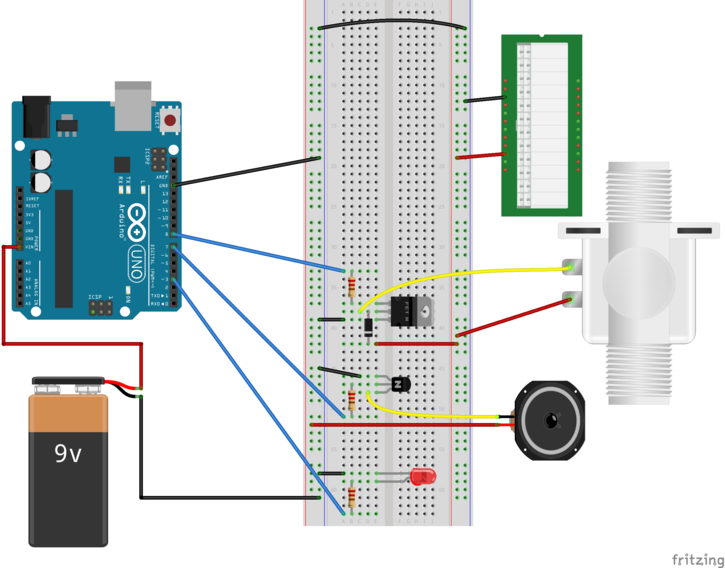

The components required for this circuit are:

* an Arduino board,
* a DC motor,
* a current-limiting resistor, e.g., 1kΩ,
* a battery pack or some additional source of power, 
* a logic-level power MOSFET (i.e., one for which the drain current is high enough
for your purposes, even when the gate-to-source voltage is only 5V), and
* a zener diode

This circuit is an embellishment of the 
[circuit for a simple solenoid motor](../../4-Motors/4d-Solenoids/circuit.html). 
The features which are added are 

* an 8Ω speaker which produces the pitches in the "melody" being played, and
* an LED which gives a visual cue when a tone should be playing.

The following diagrams introduce these circuit elements one at a time.

### The Circuit Before the Speaker-and-LED Embellishments ###

| The "Before" Circuit -- a Simple Solenoid |
|:-----------------------------------------:|
|      |

### Adding the Speaker ##3

To accompany the water display with "music" a high-power speaker is required.
The circuitry required for this speaker is exactly the same as the
[circuit for speakers](../../3-Sound/3d-speakers/circuit.html). 

| Circuit with Speaker                     |
|:----------------------------------------:|
| |

### Adding Some Indicator LEDs ###

Two LEDs were added to this circuit.  One tells when a tone is being played by
the speaker.  The other tells when the solenoid was turned on.  The circuitry
required to add these elements is the same as the
[circuit for external LEDs](../../1-LED/1c-SeveralLEDs/circuit.html).

| Circuit with Speaker and Indicator LEDs       |
|:---------------------------------------------:|
| |
