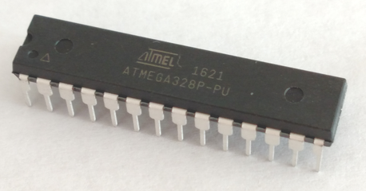

# microcontrollers.intro #

This repository contains instructional resources for teaching the basics of microcontrollers.

## What is a microcontroller? ##

A microcontroller is an integrated circuit (IC).  One microcontroller
IC is shown in the image below; there is a 
[wide variety](https://en.wikipedia.org/wiki/List_of_common_microcontrollers).
of sizes, shapes, and uses of microcontrollers.

| A microcontroller (ATMega 328PU from Atmel) |
|:-------------------------------------------:|
|                    |

Microcontrollers are *electronic* switches.  They differ from
ordinary household *electrical* switches in two ways:

* INPUT
    An electrical switch uses your finger as input: e.g., you might 
    flip a switch to turn `ON` some lights, or press a button to turn on
    a TV.  In contrast, an electronic switch (i.e., a microcontroller), 
    gets its input from a device, e.g., a digital thermometer attached to 
    the microcontroller, a microphone, a pressure sensor, a digital clock, 
    or even a counter within the microcontroller itself.

* OUTPUT
    An electrical switch generally turns on one thing, or maybe one power strip
    which then turns on a bunch of things.  A microcontroller can carry out a
    much more complicated command or (more typically) a sequence of commands. For example, 
    a microcontroller might be used to control a set of motors and create a 
    [a waterfall that draws pictures and words](http://www.3ders.org/articles/20160509-3d-printed-water-curtain-makes-waves-at-temps-de-flors-flower-show-in-girona-spain.html), or 
    [paint a light show on a Christmas tree](https://youtu.be/okyO1Fze7Jo).
    Microcontrollers are more frequently used for practical, though less glamorous functions,
    like controlling a 3D printer, or modern coffee pots, or some fancy kids' sneakers.

## How can you command the microcontroller to get the "right" inputs and provide the "right" outputs? ##

You need to write a program that will be stored on the microcontroller,
and provides a sequence of steps that:

1.  initialize the microcontroller so it knows what inputs are available for
it to read, and 

2.  give the microcontroller a series of steps to perform (on its outputs) every
time one of its inputs changes.

You *could* write that program by using the instruction set for your
microcontroller that came in the manufacturer's instruction sheet for that IC.  
To install your program on the microcontroller, you would need to build a special
circuit connecting the output of your computer to the right pins on the 
microcontroller; the pins used for input and output are also given in the
manufacturer's instruction sheet.  (You may have guessed by now that this
so-called "sheet" is often hundreds of pages long.)  Since microcontrollers 
differ in terms of their instruction sets and pinouts, you would need to
repeat these steps for every microcontroller you would use.

## Arduino makes it simple ##

A program called `arduino` and a set of circuit boards from a company named
"Arduino" greatly simplify the task of programming and communicating with
a microcontroller.

| Connecting a computer to a microcontroller board | The `arduino` GUI         |
|:------------------------------------------------:|:-------------------------:|
|                       |     |

The circuit boards allow you to communicate with the microcontoller through an 
ordinary USB cable.

## A Note on Word Usage ##

The Arduino company has made the designs of all their boards available to the public 
with an open source license.  As a result, many vendors now sell boards that 
can be used with the `arduino` program.  
So, an introduction to "arduino" might be referring to:

* the `arduino` program itself, or 
* the generic type of microcontroller boards that can accept input from an arduino program, or 
* one of the microcontroller boards sold by the Arduino company.  

## How can you get started? ##

[Lesson 1](1-LED) shows you how to get started by controlling a little LED
on your microcontroller board; you will quickly advance to controlling
a series of external LEDs.
