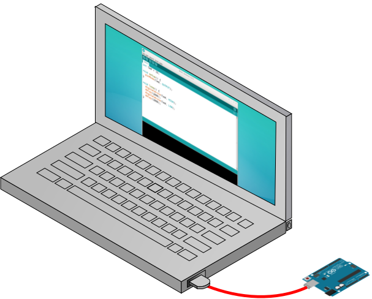
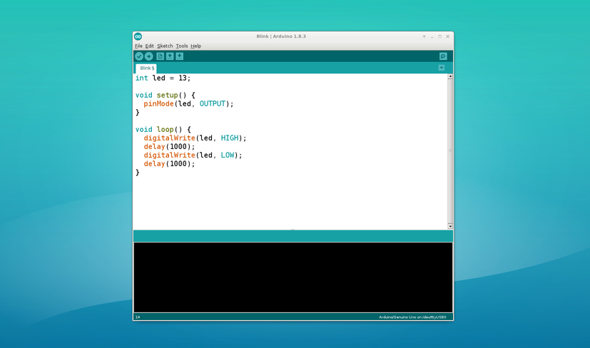

## What is a microcontroller? ##

A microcontroller is an integrated circuit (IC).  One microcontroller
IC is shown in the image below; there is a 
[wide variety](https://en.wikipedia.org/wiki/List_of_common_microcontrollers)
of sizes, shapes, memory, speed, and uses of microcontrollers.

| A microcontroller (ATMega 328PU from Atmel) |
|:-------------------------------------------:|
|                    |

Microcontrollers are *electronic* switches.  They differ from
ordinary household *electrical* switches in two ways:

* INPUT

    An electrical switch usually uses your finger as input: e.g., you flip a 
    switch to turn `ON` some lights, or press a button to turn on a TV.  

    In contrast, an electronic switch (i.e., a microcontroller), gets its input
    from a device, e.g., a digital thermometer attached to the microcontroller, 
    a microphone, a pressure sensor, a digital clock, or even a counter within 
    the microcontroller itself.

* OUTPUT

    An electrical switch generally turns on one thing, or maybe one power strip
    which then turns on a bunch of things.  

    A microcontroller can carry out a much more complicated command or sequence 
    of commands. For example, a microcontroller might be used to control a set of 
    motors and create a [a waterfall that draws pictures and words](http://www.3ders.org/articles/20160509-3d-printed-water-curtain-makes-waves-at-temps-de-flors-flower-show-in-girona-spain.html), or 
    [paint a light show on a Christmas tree](https://youtu.be/okyO1Fze7Jo).
    Microcontrollers are more frequently used for practical, though less glamorous functions,
    like controlling a 3D printer, or modern coffee pots, or some fancy kids' sneakers.

## How to control a microcontroller **☺** ##

There are three steps to customizing a microcontroller for a particular project:

1.  Write a program using a workstation (laptop or desktop). 

2.  "Compile" the program, turning it into the 1's and 0's that can be understood by the microcontroller.
   
3.  Download the program to the microcontroller, aka "flash" it, because your are
writing your compiled program to its flash memory.

**➡ Once programmed, a microcontroller will repeat the same set of commands forever.  If it
is reset or temporarily loses power, it will start again and continue running the same 
program.  This will continue until it is reprogrammed.**

## Arduino makes it simple ##

A program called `arduino` and a set of circuit boards from a company named
"Arduino" greatly simplify the task of programming and communicating with
a microcontroller.

| Connecting a computer to an Arduino board | Closeup of the `arduino` GUI  |
|:-----------------------------------------:|:-----------------------------:|
|              |  |

## Arduino's aren't for everybody ##

The `arduino` program only works for *some* microcontrollers (initially, only
microcontrollers manufactured by Atmel, but the list is growing all the time).

To program a microcontroller that is *not* built into the `arduino` program, users 
typically rely on specialized tools from the chip manufacturer, and often need to 
learn how the microcontroller works at a very basic level.

## A Note on Word Usage ##

The Arduino company has made the designs of all their boards available to the public 
with an open source license.  As a result, many vendors now sell boards that 
can be used with the `arduino` program.  
So, an introduction to "arduino" might be referring to:

* the `arduino` program itself, or 
* the generic type of microcontroller boards that can accept input from an arduino program, or 
* one of the microcontroller boards sold by the Arduino company.  

## Getting Started ##

[Lesson 1](1-LED) shows how to get started by controlling a little LED
on your microcontroller board; you will quickly advance to controlling
a series of external LEDs.
